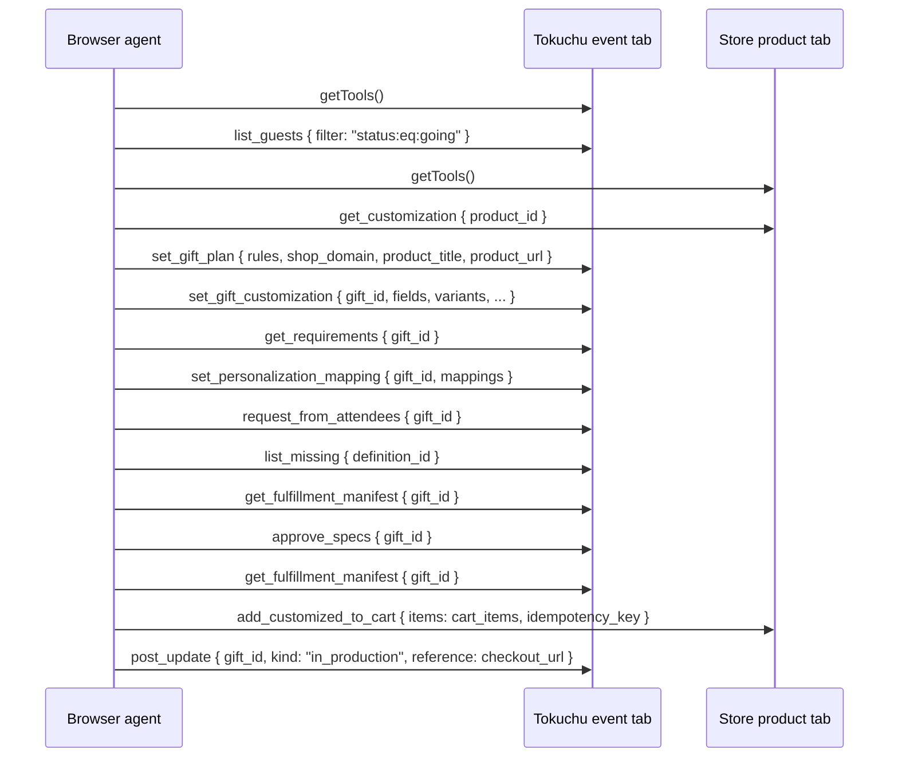
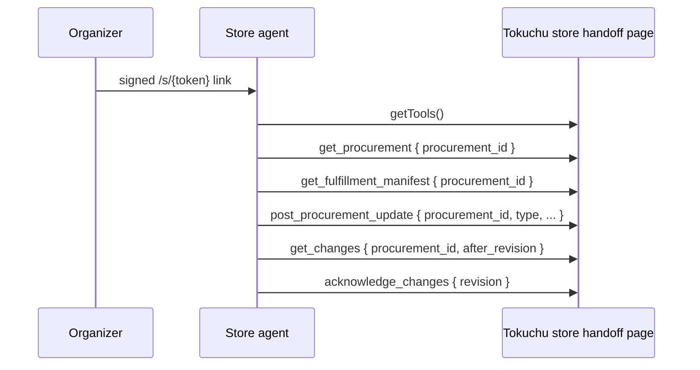

# Tokuchu

Tokuchu coordinates personalized purchases for events. It combines attendee and RSVP records with products from WebMCP-enabled Shopify storefronts, asks attendees only for information the selected product still needs, produces one fulfilment row per recipient, and gives the store a scoped channel for updates and exceptions.

The project is a submission to The WebMCP Challenge and is built against a separately deployed demo store.

## The system in one picture

Tokuchu connects three record owners. Each owns a different part of the transaction.

| Side | Owns | WebMCP surface |
| --- | --- | --- |
| Organizer / Tokuchu | Event, RSVP list, gifts, requirements, approvals, revisions, fulfilment records | The event page at `/events/{id}` |
| Attendee / Tokuchu | One attendee's RSVP and answers | The invite page at `/i/{code}` |
| Store | Products, variants, customization rules, cart, checkout | Shopify UCP plus the merchant's product-page tools |
| Store / Tokuchu handoff | A permission-limited view of one approved procurement | The grant page at `/store/{grantId}` |

The browser agent coordinates these surfaces. Tokuchu remains the system of record for the event and procurement; the store remains the system of record for the product and checkout.

## Three concepts that should not be confused

The application has two runtime modes, three actor-specific page surfaces, and two transports. These are independent concepts.

### Runtime modes

| Mode | Who performs store-side automation? | Intended use |
| --- | --- | --- |
| **Managed mode** (default) | Tokuchu's server searches Shopify, opens supported product pages, reads customization, and fills carts after approval | The normal organizer-facing application |
| **Agent handoff mode** (`TOKUCHU_STATIC=1`) | A browser or terminal agent moves data between the Tokuchu tab and store tab | The explicit cross-site WebMCP demonstration |

“Static” refers to the server avoiding outbound store automation. Tokuchu's event records and APIs are still live and mutable.

### Page surfaces

- The **event page** exposes organizer operations.
- The **invite page** exposes one attendee operation, `submit_rsvp`.
- The **store handoff page** exposes only the procurement operations allowed by its access grant.

These page surfaces exist in both runtime modes. The runtime mode changes who calls the external store, not who owns the data.

### Transports

- Page tools register on `document.modelContext` and are called through browser WebMCP.
- Token holders can call the same Tokuchu operations through JSON-RPC at `/api/events/{id}/mcp`.
- Shopify catalog and storefront operations use JSON-RPC at `https://catalog.shopify.com/api/ucp/mcp` or `https://{shop}/api/ucp/mcp`.

The transport does not define the runtime mode. For example, managed mode still uses WebMCP when the server opens a merchant product page.

## Shared procurement lifecycle

Both runtime modes implement the same business process:

1. The organizer creates and publishes an event.
2. Attendees RSVP and answer the event's existing questions.
3. A product is selected and its variants and customization contract are read from the store.
4. Tokuchu maps product requirements to attendee answers, event fields, guest names, or literals.
5. Tokuchu creates questions only for requirements that still lack a source.
6. Going attendees receive links for their missing values.
7. Tokuchu reconciles one fulfilment row per attendee and reports whether each row is ready.
8. The organizer approves the current revision.
9. One configured cart line per ready attendee is sent to the store.
10. The checkout URL is recorded on the procurement.
11. The store receives a scoped link for the approved procurement.
12. Store updates and exceptions enter Tokuchu's revisioned change log; an exception can ask one attendee for a correction.

The modes differ only in steps 3 and 9: who crosses the boundary into the storefront.

## Managed mode: Tokuchu performs the store work

Managed mode is the default application behavior. The organizer uses Tokuchu's UI or organizer tools, and Tokuchu's server performs the external calls.

### Product discovery and customization

1. The organizer invokes `search_gifts` or searches from the Guest Experience tab.
2. Tokuchu calls Shopify's Global Catalog with `search_catalog`.
3. It calls `get_product` for shortlisted candidates.
4. It probes `create_checkout` at each candidate's storefront endpoint to check delivery to the venue.
5. For a supported personalized store, Tokuchu opens the product page in a headless browser and calls `get_customization`.
6. Tokuchu stores the product, variants, fields, and inferred requirement mappings on the gift.

### Collection and approval

1. `get_requirements` shows how each product requirement will be filled.
2. `request_from_attendees` creates any missing questions and emails the affected attendees.
3. `list_missing` and `get_fulfillment_manifest` show collection and reconciliation progress.
4. `approve_specs` records the approved revision.

### Cart and checkout

After `approve_specs`, Tokuchu starts an asynchronous cart job:

1. It builds `cart_items` from the ready fulfilment rows.
2. For a personalized product, it opens the merchant page and calls `add_customized_to_cart`.
3. For a standard Shopify product, it uses the storefront UCP cart operations.
4. It records blocked lines, progress updates, and the returned checkout URL.

In this mode the organizer or browser agent does **not** manually carry `cart_items` to the store tab.

## Agent handoff mode: the agent bridges two pages

Start this mode with `TOKUCHU_STATIC=1`. Tokuchu performs no outbound catalog search, opens no merchant page, and starts no cart-fill job. The agent explicitly transfers the product contract and cart payload between tabs.

`search_gifts`, `send_to_vendor`, and `approve` are not registered in this mode because they imply server-side store work. `approve_specs` remains available because approval is a Tokuchu record operation.

### Complete two-tab sequence



The important handoffs are:

- **Store → Tokuchu:** the complete `get_customization` result becomes the input to `set_gift_customization`.
- **Tokuchu → Store:** `cart_items` from `get_fulfillment_manifest` become the items passed to `add_customized_to_cart`.
- **Store → Tokuchu:** the returned `checkout_url` is recorded with `post_update`.

The event, invite, and store handoff pages include a visible Agent notes block and a `tokuchu-agent-task` meta tag in this mode. The Guest Experience tab also shows the next operation expected on each side.

## Store handoff flow

The store handoff is a separate phase after cart preparation. It is not the “store tab” used to read a product or fill a cart.

The organizer creates an access grant and sends its signed `/s/{token}` link to the store. The link opens `/store/{grantId}`, where Tokuchu registers only the tools permitted by that grant.



Grant permissions map to tools as follows:

| Permission | Tools |
| --- | --- |
| `manifest:read` | `get_procurement`, `get_manifest`, `get_fulfillment_manifest` |
| `requirements:read` | `get_requirements` |
| `changes:read` | `get_changes`, `acknowledge_changes` |
| `updates:read` | `get_updates` |
| `updates:write` | `post_update`, `post_procurement_update` |

The MCP endpoint reads the grant again on every call. Revocation or expiry therefore takes effect immediately. Gift access and readable attendee attributes are filtered server-side, not only hidden in the page.

## Tool ownership

### Tokuchu organizer tools

The event page registers the organizer-scoped subset of the following operations:

- Guest records: `get_guest`, `list_guests`, `count_by`, `list_missing`, `get_summary`
- Gift planning: `search_gifts`, `set_gift_plan`, `set_gift_customization`, `set_personalization_mapping`
- Requirements: `get_requirements`, `request_from_attendees`, `follow_up`
- Reconciliation: `get_manifest`, `get_fulfillment_manifest`, `get_procurement`
- Approval and purchasing: `send_to_vendor`, `approve_specs`, `approve`
- Progress and revision history: `post_update`, `post_procurement_update`, `get_updates`, `get_changes`, `acknowledge_changes`

### Tokuchu attendee tool

`submit_rsvp` is registered on `/i/{code}` with a JSON Schema generated from the questions currently shown to that attendee. Store-derived limits such as allowed values, maximum lengths, patterns, and date formats travel with the schema.

### Merchant product-page tools

The Customworks theme adapter registers:

- `get_customization` — returns product fields, constraints, variants, availability, and prices.
- `add_customized_to_cart` — validates a batch, adds one configured Shopify line per attendee, and returns ready and blocked rows plus a checkout URL.

The adapter is under `integrations/customily/`. It reads customization metadata from a page-level definition or its product adapter map and writes customization values as Shopify line-item properties.

### Shopify UCP tools Tokuchu calls

The local `@webmcp/shopify-ucp` package supports:

- Catalog: `search_catalog`, `lookup_catalog`, `get_product`
- Cart: `create_cart`, `update_cart`, `get_cart`, `cancel_cart`
- Checkout and order: `create_checkout`, `get_order`

Every Shopify call includes the public UCP agent profile in `arguments.meta["ucp-agent"].profile` and requires no private API key.

## Application structure

| Path | Role |
| --- | --- |
| `src/domain/` | Event, guest, gift, value, requirement, reconciliation, procurement, and change-log rules |
| `src/server/` | API operations, persistence, auth, grants, MCP dispatch, search, cart jobs, manifests, exceptions, mail, and tracing |
| `src/agent/` | Catalog search, delivery checking, ranking, cart operations, and optional curation agent |
| `src/webmcp/` | Central tool definitions, page registration, route mapping, agent task text, and polyfill |
| `src/app/` | Next.js pages and API routes for organizers, attendees, demos, and store grants |
| `packages/shopify-ucp/` | Typed JSON-RPC client for Shopify Global Catalog and storefront UCP endpoints |
| `integrations/customily/` | The demo merchant's product-page WebMCP adapter |
| `src/demo/` | Seeded event and guided tour state |
| `tests/` | Browser coverage for the UI, WebMCP surfaces, static agent flow, and two-sided acceptance flow |

The central tool catalog is `src/webmcp/tools.ts`. Browser registration is in `src/webmcp/register.ts`, and token-authenticated JSON-RPC dispatch is in `src/server/mcp.ts`.

## Running locally

```sh
npm run setup
npm run dev                              # managed mode at http://localhost:3113
npm test
npm run typecheck
npm run test:e2e
```

Agent handoff mode:

```sh
TOKUCHU_STATIC=1 npm run dev -- -p 3114
npm run test:static
npm run agent-playbook
```

Live-store suites:

```sh
LIVE_CUSTOMILY=1 npm run test:flow-demo
LIVE_CUSTOMILY=1 npx playwright test tests/acceptance.spec.ts
```

`LLM_ENABLED=1` enables the optional curation agent and chat panel in managed mode. It remains off in agent handoff mode. Without `DATABASE_URL`, local development stores events in memory and treats an unauthenticated request as the local organizer.

## Documentation map

- `docs/prd.md` — product requirements and domain behavior
- `docs/webmcp-routing.md` — tool-to-route mapping and hop-by-hop transport details
- `docs/guide.md` — organizer-facing walkthrough
- `docs/agent-playbook.md` — instructions and error handling for an agent driving both pages
- `docs/diagrams/agent-sequence.mmd` — agent handoff sequence source
- `docs/diagrams/store-sequence.mmd` — store grant sequence source

## Deployment

The production target is a Render Web Service backed by Render Postgres. The Docker image uses Microsoft's Playwright base image so the bundled Chromium matches the installed Playwright version. Each deploy runs the database migration before starting the standalone Next.js server.

Required deployment configuration is documented in `.env.example`. The principal external values are the database URL, authentication secret and URL, Resend configuration, organizer allowlist, optional OpenAI key, demo store URL, and Shopify Admin credentials used to install or refresh the theme adapter.

Authentication uses email magic links through Resend. Without a mail key, development logs the link to the console. Demo guests can create an account to retain their event. Attendee requests and correction emails use the same mail system and link back to the appropriate invite record.

To install or refresh the demo store's merchant adapter through the Shopify Admin API:

```sh
node --env-file=.env --import tsx scripts/install-theme-adapter.ts
```

Use `--dry-run` to inspect the theme change without writing it.
