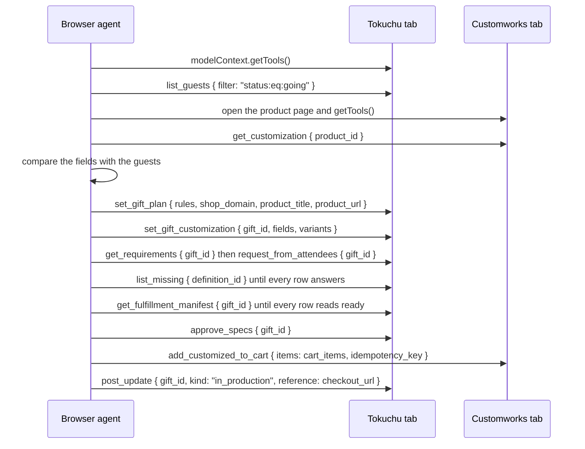
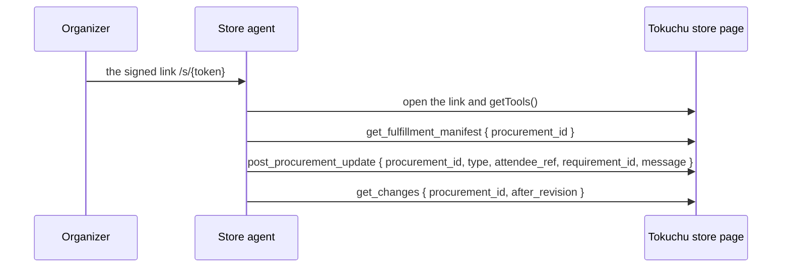

# Tokuchu

Tokuchu is an event procurement system that uses attendee information and WebMCP-enabled storefronts to coordinate personalized purchases for events. It presents the RSVP list and the order's records as WebMCP tools, so one agent drives two pages: the store's product page, where Shopify's commerce tools and the store's own `get_customization` and `add_customized_to_cart` register, and Tokuchu's event page, where the records register. The agent reads the product's requirements on the store's page and hands them to Tokuchu; Tokuchu asks each attendee only for the values the RSVP list lacks; the agent approves at a revision and carries the manifest's cart items back to the store's page, where the store fills its cart and returns the Shopify checkout. A signed link then opens a store-facing page whose tools let the store's own agent read the fulfilment manifest and post exceptions that route back to the attendees. The project is built against one live demo store, deployed as a separate component, and is a submission to The WebMCP Challenge.

The specification is `docs/prd.md`, the hop-by-hop routing is `docs/webmcp-routing.md`, the screen-by-screen guide for an organizer is `docs/guide.md`, and the prompt and steps for an agent that drives both pages is `docs/agent-playbook.md`.

## How it works

One browser agent holds two tabs: Tokuchu's event page and the Customworks product page. Each arrow below is one WebMCP call, and every document in `docs/` follows the same thirteen arrows in the same order. The source is `docs/diagrams/agent-sequence.mmd` and the rendered image is `public/media/agent-sequence.webp`.



1. `getTools` on the Tokuchu tab: the event page's tool list, one entry per record operation.
2. `list_guests` with `{ filter: "status:eq:going" }`: every attendee who replied going, with the answers the RSVP list holds.
3. Open the Customworks product page and `getTools`: Shopify's storefront tools and the store's `get_customization` and `add_customized_to_cart`.
4. `get_customization` with `{ product_id }`: the product's fields with their kinds and limits and the variants with their ids.
5. The agent compares the fields with the guests: which fields the RSVP list already fills and which the attendees must answer.
6. `set_gift_plan` with `{ rules, shop_domain, product_title, product_url }`: the gift for the product and its `id`.
7. `set_gift_customization` with `{ gift_id, fields, variants }`: the store's payload recorded as the gift's requirement schema.
8. `get_requirements` then `request_from_attendees`, both with `{ gift_id }`: the source that fills each requirement, then a request to every going attendee who lacks an answer.
9. `list_missing` with `{ definition_id }`, repeated until every row answers: the attendees who still owe a value for one question.
10. `get_fulfillment_manifest` with `{ gift_id }`, repeated until every row reads ready: one graded row per attendee and the `cart_items` for the store.
11. `approve_specs` with `{ gift_id }`: the approval and the change-log revision it records.
12. `add_customized_to_cart` on the Customworks tab with `{ items: cart_items, idempotency_key }`: one cart line per attendee and the `checkout_url`.
13. `post_update` with `{ gift_id, kind: "in_production", reference: checkout_url }`: the checkout link on the gift's progress log.

The store's own side runs as a second sequence after the thirteenth arrow (`docs/diagrams/store-sequence.mmd`): the organizer sends the store a signed link, the store's agent opens it and lists the page's tools, reads `get_fulfillment_manifest`, posts `post_procurement_update`, and reads `get_changes`.



## Who exposes what

| Capability | Exposed by | Page or endpoint | Purpose |
| --- | --- | --- | --- |
| `search_catalog`, `get_product`, the cart tools | Shopify WebMCP | every storefront page and the UCP endpoint at `{shop}/api/ucp/mcp` and the Global Catalog | Find candidate products and read variants; Tokuchu's own catalog search calls the endpoints for an organizer who types a sentence |
| `get_customization` | Customworks WebMCP | the store's product page | Return the product's requirements with their kinds and limits and the live variants |
| `add_customized_to_cart` | Customworks WebMCP | the store's product page | Add one configured item per attendee to the store's cart and return the checkout link |
| `list_guests`, `set_gift_plan`, `set_gift_customization`, `get_requirements`, `set_personalization_mapping`, `request_from_attendees`, `follow_up`, `list_missing`, `get_fulfillment_manifest`, `approve_specs`, `post_update`, `get_updates`, `get_changes` and the rest of the organizer list | Tokuchu WebMCP | the event page at `/events/{id}` and the MCP endpoint at `/api/events/{id}/mcp` for a token holder | Read the RSVP list, create the gift from the store's payload, request the missing values, approve at a revision, and read the cart items |
| `submit_rsvp` | Tokuchu WebMCP | the invite page at `/i/{code}` | Let an attendee's agent reply and answer the product's questions within the store's limits |
| `get_procurement`, `get_fulfillment_manifest`, `get_requirements`, `get_changes`, `acknowledge_changes`, `get_updates`, `post_procurement_update` | Tokuchu WebMCP | the store-facing page at `/store/{grantId}` that a grant's signed link opens | Let the store's agent read the manifest at the approved revision and post accepted or fulfilled or an exception on a value it cannot use |

Shopify gives every store a common commerce surface. Customworks adds the operations a made-to-order product needs. Tokuchu adds the records on the organizer's side and the store-facing view of one procurement. The store-facing page registers only the tools the grant's permissions allow: `manifest:read` registers `get_procurement`, `get_manifest`, and `get_fulfillment_manifest`; `requirements:read` registers `get_requirements`; `changes:read` registers `get_changes` and `acknowledge_changes`; `updates:read` registers `get_updates`; `updates:write` registers `post_update` and `post_procurement_update`.

## What is in it

| Path | Role |
| --- | --- |
| `src/domain/` | records (`types.ts`), the store and change log (`store.ts`), value types (`values.ts`), the filter grammar (`filter.ts`), the gift (`gifts.ts`), field sources and resolution (`personalization.ts`), the procurement view of the change log and its status machine (`procurement.ts`, `procurement-status.ts`), the store's requirement schema with its id and version and diff (`requirement-schema.ts`), the reconciliation rows (`reconciliation.ts`) |
| `src/server/` | the operations behind the routes and the tools (`api.ts`), the catalog search (`search.ts`), the cart operations (`cart-api.ts`, `cart-job.ts`, `catalog-cart.ts`), the MCP endpoint with tokens (`mcp.ts`), access grants (`grants.ts`), the reconciliation service (`reconcile.ts`), the fulfilment manifest and exceptions (`procurement.ts`), the signed store link (`store-session.ts`), the CSV export (`fulfillment-csv.ts`), the agent trace (`trace.ts`), the feature flags (`flags.ts`), the Admin API client (`shopify-admin.ts`) |
| `src/agent/` | catalog search, delivery probe, and ranking (`search.ts`), the cart at the store (`cart.ts`), the curation agent (`curation-agent.ts`) |
| `src/webmcp/` | the tool definitions as data mapped to routes (`tools.ts`), registration on `document.modelContext` for the event page and the store page (`register.ts`), the agent task text for static mode (`agent-task.ts`), the polyfill |
| `src/app/` | the landing page at the root, sign-in, the organizer's event list at `/events`, the draft at `/events/new`, the invite form, the dashboard (Overview, Guest Experience, Attendees, with the readiness grid, the Share fulfilment data block, the Agent trace drawer, and the static-mode handoff card), the signed link at `/s/{token}`, the store-facing page at `/store/{grantId}`, and the API routes |
| `src/demo/` | the seeded event and the tour's steps across the three gifts and the store's side |
| `public/media/` | the five walkthrough clips recorded by `scripts/capture-home-media.ts` and the four store-side captures from the guide |
| `packages/shopify-ucp/` | the client for the Global Catalog and a store's UCP endpoint, as a local workspace |
| `integrations/customily/` | the merchant WebMCP tools the store's theme loads, with installation notes |
| `tests/` | Playwright: the landing page, draft, invite, overview, experience, the tools through the polyfill, the store page and its tools, the readiness grid, the two-sided acceptance run, the static-mode agent run, and the recorded flow demo |
| `scripts/` | the database migration, the walkthrough and guide captures, the theme adapter install, and the scripted agent playbook run (`agent-playbook.mjs`) |

## Running

From the repo root:

```sh
npm run setup                            # install, Playwright Chromium, hooks, .env check
npm run dev                              # http://localhost:3113
npm test                                 # vitest (LIVE_SHOPIFY=1 adds the live catalog and cart tests)
npm run typecheck
npm run test:e2e                         # the Playwright suites except the live ones
LIVE_CUSTOMILY=1 npm run test:flow-demo  # the recorded flow demo against the live store
TOKUCHU_STATIC=1 npm run dev -- -p 3114  # a static server for a browser or terminal agent
npm run test:static                      # the agent across both pages with the polyfill against port 3114
npm run agent-playbook                   # the playbook as a script with a video per page
```

The app runs in two modes. In normal mode the organizer clicks through the screens and the server does the store work itself: it searches the catalog and opens the store's product page in a headless browser to call `get_customization` and `add_customized_to_cart`. In static mode (`TOKUCHU_STATIC=1`) the server makes no catalog search and opens no store page; the agent reads `get_customization` on the store's page and hands the payload to Tokuchu through `set_gift_customization`, and after `approve_specs` it takes the `cart_items` that `get_fulfillment_manifest` returns to the store's page and calls `add_customized_to_cart` there. The Guest Experience tab then shows a handoff card per gift with the store URL, the product handle, the gift id, and the next tool on each side, and every page carries an Agent notes block and a `tokuchu-agent-task` meta tag with the order of operations. `docs/agent-playbook.md` holds the prompt, the steps, and the meaning of each error text. `npm run test:static` plays the agent across both pages against a static server on port 3114 (`LIVE_CUSTOMILY=1` adds the live store half), and `npm run agent-playbook` runs the playbook as a script against `AGENT_BASE` or `http://localhost:3114` and records a video per page.

`LLM_ENABLED=1` switches on the curation agent and its panel on the Guest Experience tab; a server without it answers the curate route with 501 and never loads `@openai/agents`, and static mode keeps it off.

The demo store sells a customizable crewneck and a ceramic mug. Its product pages carry Shopify's storefront WebMCP tools and the two merchant tools. The recorded flow demo chooses three gifts, the crewneck, the mug with a photo per attendee, and a food item from another Shopify store ordered through that store's UCP cart, and opens the crewneck's checkout link in a fresh browser to assert one line per attendee. The acceptance run (`LIVE_CUSTOMILY=1 npx playwright test tests/acceptance.spec.ts`) records the two-sided flow, one browser per side, through the store's exception and the attendee's correction.

The landing page's walkthrough clips in `public/media/` come from the flow demo. With the dev server up and ffmpeg on PATH, `LIVE_CUSTOMILY=1 npx tsx scripts/capture-home-media.ts` runs the five steps against the live store and writes one GIF per step under the 1000 KB limit the pre-commit hook enforces; `APP_URL` points it at a server on another port. `scripts/capture-guide.mjs` writes the guide's screens under `docs/media/guide/`.

The demo store's theme carries the merchant tools. To install or refresh them through the Admin API, run `node --env-file=.env --import tsx scripts/install-theme-adapter.ts`; `--dry-run` prints the change without writing, and the previous layout is saved beside the script's output.

## Deployment

The app runs on Render as a Web Service built from the `Dockerfile`, with Render Postgres holding one JSON document per event and the sign-in tables. The image starts from Microsoft's Playwright image at the version `package-lock.json` pins, so the Chromium the approval job launches matches the `playwright` package in the build; `next build` writes the standalone server the runtime stage copies, and the migration entry compiles to `migrate.mjs` beside it. `render.yaml` declares the service, the database, and the environment. To deploy, connect the repository in the Render dashboard as a Blueprint, apply it, and fill the values it marks `sync: false` (`RESEND_API_KEY`, `ORGANIZER_EMAILS`, `AUTH_EMAIL_FROM`, `OPENAI_API_KEY`, `CUSTOMILY_SHOP_URL`, and the four Shopify Admin keys). Render fills `DATABASE_URL` from the database, `AUTH_URL` and `APP_URL` from the service's own public URL, and generates `AUTH_SECRET`. Each deploy runs `node /app/migrate.mjs` before the new server starts, so the first deploy creates the tables in a fresh database.

A dev server without `DATABASE_URL` keeps events in its memory and runs a request without a session as one local organizer, so the browser suites and the flow demo need no sign-in. Sign-in uses a magic link sent through Resend; a first sign-in creates the account. `ORGANIZER_EMAILS` unset or empty lets any address sign in, and set, it names the only addresses that may. A dev server without `RESEND_API_KEY` logs the link to its console instead. An address the allowlist denies, or a production server with no mail key, lands on the not-found page and its link to the demo. The demo runs without an account as a guest; the guest keeps its demo event by creating an account, and `npm run reparent-events` gives rows persisted before ownership existed an owner. Attendee requests and follow-ups go out through the same Resend key in production or with `MAIL_LIVE=1`, and the links in them point at `APP_URL`; any other server logs one line per message. The curation agent and its panel on the experience tab run only with `LLM_ENABLED=1`; a server without it answers the curate route with 501 and never loads `@openai/agents`. The environment names are listed in `.env.example`.
