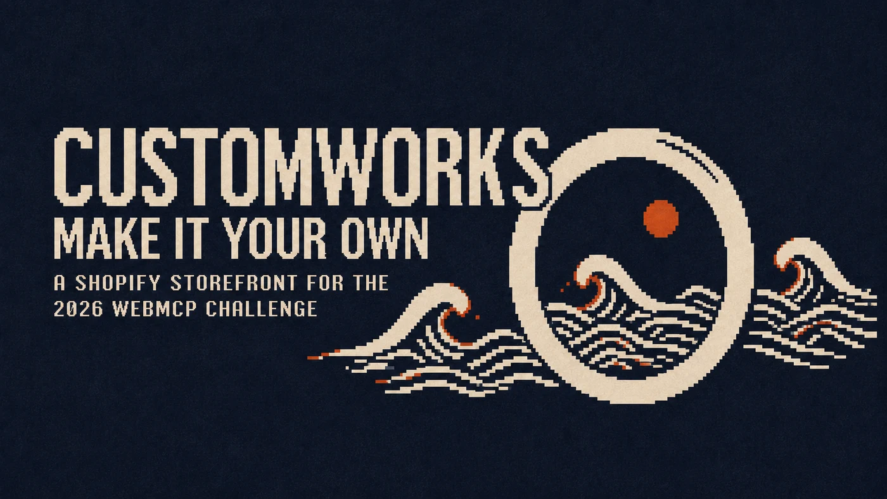

# Tokuchu

Event organizers often request customizations, from dietary restrictions to names printed on party favours. The difficult part is collecting the specifications: the organizer may not yet know who is attending, what each guest needs, or which details a vendor requires. That uncertainty creates manual back and forth among the guest list, the storefront, and the vendor.

Agents can coordinate this information when there is an intermediate source of truth that can both consume requirements from an e-commerce site and expose the resulting fulfilment data back to authorized agents through WebMCP.

## Using Tokuchu with a WebMCP browser agent

The primary way to use Tokuchu is through a WebMCP browser agent, like ChatGPT Browser. Send these prompts to the agent one at a time, reviewing each response before sending the next.

**Stage 1 — Create the event:**

> Use the chat browser and Tokuchu's WebMCP tools to create the Eastern Canada Astronomy Symposium at tokuchu.onrender.com for March 18, 2027, at noon Toronto time, at the Ontario Science Centre. Add Tokuchu's ten sample attendees.

**Stage 2 — Review a recommendation:**

> Then, open Customworks at springbuilt.myshopify.com in the chat browser and use its WebMCP tools to find a personalized apparel gift for our attendees. Show me the best option and total before creating a plan.

**Stage 3 — Prepare the checkout:**

> Use that option for everyone marked going, with each person's name on their gift. Reuse their saved details and company wide states. Prepare one item per complete attendee, leave incomplete attendees pending, and save the checkout in Tokuchu. Tell me who's included, who's pending, and the total.

No account is needed. Guest events expire after 24 hours. Emails are logged, not sent.

The browser agent discovers the WebMCP tools registered on Tokuchu's pages and on the store's pages, then coordinates the event, the attendee data, and the checkout across both sites.

## Two sister websites

Tokuchu explores this model through a pair of websites. Both expose custom WebMCP functions, allowing agents on either side of a purchase to work against the same evolving order state.

| Tokuchu | Customworks |
| --- | --- |
|  |  |
| Maintains attendee information, requirements, readiness, approvals, and procurement records. | Supplies product requirements, variants, prices, and configured cart creation. |

## Three ways to interact

| Method | Description |
| --- | --- |
| **WebMCP browser agent** | The primary experience. Send the prompts above to a WebMCP-capable browser agent, like ChatGPT Browser. The agent discovers WebMCP tools on Tokuchu and Customworks and coordinates the procurement across both sites. |
| **Tokuchu interface and click-through demo** | Explore Tokuchu's interface directly. The `/demo` route runs a guided walkthrough on a seeded event. Browser agents can also interact with and manipulate this interface, including its in-app chatbox where available. |
| **Local Stagehand runner** | A separately configured local runtime that operates across the websites. See [the agent-mode guide](docs/agent-mode.md) for installation and runtime requirements. |

These interaction methods are distinct from backend runtime modes. The interface walkthrough and in-app chatbox belong to the managed experience; the Stagehand runner is a particular implementation of an external browser agent.

### The click-through demo

The `/demo` route opens a click-through version of the Tokuchu interface that agents can also interact with and manipulate. It runs a guided walkthrough of the procurement flow on a seeded event with three gifts: the store's crewneck, the store's mug, and a food item from the Shopify catalog.

A signed-in organizer gets the seeded event created under their account. A visitor without a session becomes a guest. Guest events expire after 24 hours. Creating an account from the band keeps the event.

### The in-app chatbox

Tokuchu's interface includes an in-app chatbox (`LLM_ENABLED=1`). It uses the OpenAI Agents SDK and deterministic server function tools. The chatbox can read and manage event state and curate a gift. It cannot approve an order, send a cart, or check out.

A browser agent operating Tokuchu's interface can enter text into the chatbox; the chatbox and server then execute the resulting workflow. This is distinct from a browser agent directly discovering and calling page WebMCP tools.

## The procurement flow

The order runs as WebMCP calls between the agent, the Tokuchu tab, and the Customworks tab.

1. **Create the event.** The agent opens Tokuchu's home page, calls `create_event` with the event details, and `load_sample_attendees` to add attendees. The event page carries the session that owns the event.
2. **Browse the store.** The agent opens the Customworks product page and calls `get_customization` to read the product's fields, kinds, constraints, and variants.
3. **Record the plan.** The agent returns to Tokuchu and calls `set_gift_plan` with the product and store details, then `set_gift_customization` with the store's payload.
4. **Map and request.** `get_requirements` shows which requirements are already resolved from attendee data and which need answers. `request_from_attendees` sends each attendee with a missing value a request by email.
5. **Prepare the checkout.** `get_fulfillment_manifest` returns one row per attendee with their status. `approve_specs` records the approval at the current revision. `add_customized_to_cart` on the store's page builds one cart line per complete attendee. The checkout link is recorded on the gift through `post_update`.

Items are prepared for complete attendees. Incomplete attendees stay pending until they answer the request Tokuchu sent them. The checkout ends at the recorded link and a report of who is included and who is pending. The organizer reviews the cart and pays at the store's checkout.

### After checkout

Payment-dependent updates and vendor-grant collaboration are subsequent workflows. The organizer creates store access from the Share block, and the store's agent reads the manifest, posts the order's progress, and raises structured exceptions through the signed link.

## The utility hierarchy

The many WebMCP calls serve four larger utilities. These are the stable product concepts; tool names are implementation details beneath them.

### 1. Plan a suitable gift — for the organizer

Tokuchu helps the organizer find a product that fits the event. The store describes exactly how that product may be configured through `get_customization`. The result is a gift plan with a versioned product requirement contract.

### 2. Make every recipient ready — for the organizer and attendees

Tokuchu compares the product contract with information already present in the event and RSVP records. It maps reusable values automatically, creates questions only for unresolved requirements, and asks only the affected attendees.

### 3. Approve and prepare the order — for the organizer

When the fulfillment manifest's ready rows form a sufficient batch, the organizer approves. The store's `add_customized_to_cart` creates one personalized cart line per complete recipient and returns the checkout link. Incomplete attendees join a later revision when they answer.

### 4. Collaborate on fulfilment — for the store and affected attendees

After approval, the organizer gives the store a signed, permission-limited Tokuchu link. The store can read only the approved procurement data it needs, acknowledge revisions, report production or fulfilment, and raise a structured exception.

## Runtime modes

The four utilities above are the product. The runtime mode decides who performs the cross-site handoffs.

| Mode | Experience | Boundary crossing |
| --- | --- | --- |
| **Managed mode** (default) | The organizer works in Tokuchu as a conventional application | Tokuchu's server searches Shopify, reads supported product pages, and prepares the store cart after approval |
| **Agent mode** (`TOKUCHU_STATIC=1`) | An agent works across an event tab and a product tab | The agent carries the product contract, approved cart items, and checkout reference between the two sites |

In managed mode, product discovery runs through Shopify's Global Catalog and store UCP endpoints. The server ranks results, checks delivery eligibility, and handles the store page's WebMCP tools in a headless browser. The [interface guide](docs/guide.md) walks through the managed experience.

## Application structure

| Path | Role |
| --- | --- |
| `src/domain/` | Event, guest, gift, value, requirement, reconciliation, procurement, and change-log rules |
| `src/server/` | API operations, persistence, auth, grants, MCP dispatch, search, cart jobs, manifests, exceptions, mail, and tracing |
| `src/agent/` | Stagehand browser-agent runtime plus catalog search, delivery checking, ranking, cart operations, and optional curation agent |
| `src/webmcp/` | Central tool definitions, page registration, route mapping, agent task text, and polyfill |
| `src/app/` | Next.js pages and API routes for organizers, attendees, demos, and store grants |
| `packages/shopify-ucp/` | Typed JSON-RPC client for Shopify Global Catalog and storefront UCP endpoints |
| `integrations/customily/` | The demo merchant's product-page WebMCP adapter |
| `src/demo/` | Seeded event and guided tour state |
| `tests/` | Browser coverage for the UI, WebMCP surfaces, static agent flow, and two-sided acceptance flow |

The central tool catalog is `src/webmcp/tools.ts`. Browser registration is in `src/webmcp/register.ts`, and token-authenticated JSON-RPC dispatch is in `src/server/mcp.ts`.

## Running locally

```sh
npm run setup
npm run dev                              # managed mode at http://localhost:3113
npm test
npm run typecheck
npm run test:e2e
```

Agent mode:

```sh
TOKUCHU_STATIC=1 npm run dev -- -p 3114
npm run test:static
npm run agent-run -- "Order the crewneck for every attendee going and report the checkout link."
npm run agent-playbook                   # the deterministic fallback with Playwright
```

Live-store suites:

```sh
LIVE_CUSTOMILY=1 npm run test:flow-demo
LIVE_CUSTOMILY=1 npx playwright test tests/acceptance.spec.ts
```

`LLM_ENABLED=1` enables the optional curation agent and chat panel in managed mode. It remains off in agent mode. Without `DATABASE_URL`, local development stores events in memory and treats an unauthenticated request as the local organizer.

## Documentation map

- `docs/prd.md` — product requirements and domain behavior
- `docs/guide.md` — organizer-facing interface walkthrough
- `docs/webmcp-routing.md` — tool-to-route mapping and hop-by-hop transport details
- `docs/agent-mode.md` — installing and running the local Stagehand implementation
- `docs/agent-runtime.md` — operating rules for the browser agent runtime
- `docs/agent-playbook.md` — instructions and error handling for an agent driving both pages
- `docs/architecture.md` — component boundaries, tools, and transports

## Deployment

The production target is a Render Web Service backed by Render Postgres. The Docker image uses Microsoft's Playwright base image so the bundled Chromium matches the installed Playwright version. Each deploy runs the database migration before starting the standalone Next.js server.

Required deployment configuration is documented in `.env.example`. The principal external values are the database URL, authentication secret and URL, Resend configuration, organizer allowlist, optional OpenAI key, demo store URL, and Shopify Admin credentials used to install or refresh the theme adapter.

Authentication uses email magic links through Resend. Without a mail key, development logs the link to the console. Demo guests can create an account to retain their event. Attendee requests and correction emails use the same mail system and link back to the appropriate invite record.

To install or refresh the demo store's merchant adapter through the Shopify Admin API:

```sh
node --env-file=.env --import tsx scripts/install-theme-adapter.ts
```

Use `--dry-run` to inspect the theme change without writing it.
