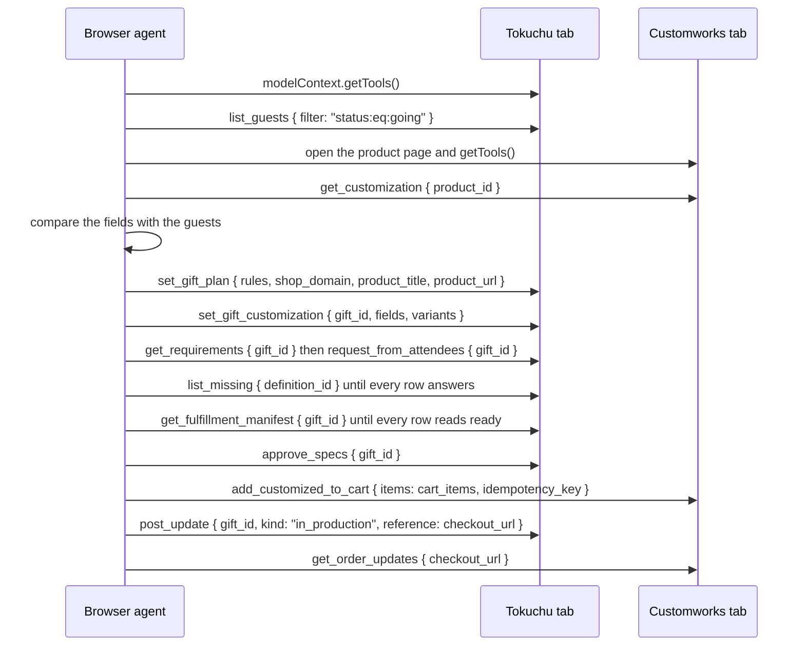
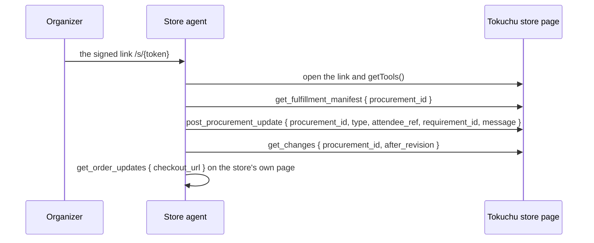

# Agent playbook

This document gives a browser agent, or a terminal agent with a browser tool, the prompt and the steps to run one gift order through Tokuchu and the demo store. It applies to a Tokuchu server in static mode (`TOKUCHU_STATIC=1`), where the server makes no catalog search and opens no store page of its own; every capability is a WebMCP tool on a page, and the agent moves between Tokuchu's pages and the store's product page. `scripts/agent-run.mjs` hands this document to a model with a browser and lets it choose the calls, and `scripts/agent-playbook.mjs` follows the same steps with Playwright in place of a model, so a judge can repeat either path.

The whole run is fourteen arrows between three participants. The order of operations below numbers them the same way, and `README.md`, `docs/guide.md`, and `docs/prd.md` refer to the same numbers. The source is `docs/diagrams/agent-sequence.mmd`; the rendered image under `public/media` predates the fourteenth arrow, `get_order_updates`, and shows the first thirteen.



## The task

The organizer has published an event and the attendees have replied going. The agent reads the store's customization contract for the crewneck on the store's product page, hands it to Tokuchu, has Tokuchu ask each attendee only for the values the RSVP list lacks, waits until every attendee's row reads ready, approves, takes the cart items Tokuchu prepares back to the store's page, fills the store's cart with one line per attendee, and records the checkout link on the gift. The store's own agent then reads the manifest through a signed link and posts its updates.

## The two pages

| Page | URL | Session | Tools |
|---|---|---|---|
| Tokuchu event page | `https://<tokuchu host>/events/<event id>` | An organizer session (sign in with an email address) or the demo guest link `https://<tokuchu host>/demo`, which creates a guest event and lands on it | `list_guests`, `set_gift_plan`, `set_gift_customization`, `get_requirements`, `set_personalization_mapping`, `request_from_attendees`, `list_missing`, `get_fulfillment_manifest`, `approve_specs`, `post_update`, `get_updates`, `get_changes` |
| Customworks product page | `https://springbuilt.myshopify.com/products/1566-comfort-colors-garment-dyed-adult-crewneck-sweatshirt` | None | `get_customization`, `add_customized_to_cart`, `get_order_updates`, and Shopify's storefront tools |

The Tokuchu page shows the store's URL, the product handle, the gift id, and the next tool on each side on its handoff card, and its Agent notes block and the `tokuchu-agent-task` meta tag carry the order below. The attendee's invite page (`/i/<code>?guest=<guest id>`) registers `submit_rsvp`, and the store-facing page a grant's signed link opens registers the grant's tools.

## Listing and calling a page's tools

Every page registers its tools on `document.modelContext`. In a browser with native WebMCP support the object exists on load; in Playwright's Chromium or another browser without it, open the Tokuchu page with `?webmcp=polyfill` on the URL, and inject `src/webmcp/polyfill.js` as an init script before the store's page loads.

List the tools:

```js
(await document.modelContext.getTools()).map((t) => t.name)
```

Call one and read its text payload:

```js
JSON.parse((await document.modelContext.executeTool((await document.modelContext.getTools()).find((t) => t.name === "list_guests"), { filter: "status:eq:going" })).content[0].text)
```

A failed call returns `isError: true` and a payload `{ error }` whose text names the field, the record, the limit, or the revisions involved; the table below says what each means.

## The order of operations

Each step is one arrow of the diagram, in the diagram's order and wording.

1. **`getTools` on the Tokuchu tab.** On the Tokuchu event page, list the tools with `document.modelContext.getTools()`. The list carries every organizer tool the rest of this order names.
2. **`list_guests { filter: "status:eq:going" }`.** Read the guests who replied going. Each row carries the guest id, the display name, and the answers the RSVP list already holds.
3. **Open the product page and `getTools`.** Open the store's product page with the polyfill injected and list its tools. The list carries Shopify's storefront tools and the store's `get_customization`, `add_customized_to_cart`, and `get_order_updates`.
4. **`get_customization { product_id }`.** Call it with `{ product_id: "10242071789817" }`. The payload carries the product id, the title, the fields (key, label, kind, required, constraints), the variants with their numeric ids, and the selected variant. Keep the whole payload.
5. **Compare the fields with the guests.** Read the fields from step 4 against the rows from step 2: the name field matches the RSVP name, and the location, the time, and the size have no answer yet. Tokuchu makes the same comparison in step 8; this step tells the agent what to expect.
6. **`set_gift_plan { rules, shop_domain, product_title, product_url }`.** Back on Tokuchu, call it without a `gift_id`: `{ rules: [{ filter: [{ field: "status", op: "eq", value: "going" }], product_id: "10242071789817" }], shop_domain: "springbuilt.myshopify.com", product_title: <the title>, product_url: <the product page URL> }`. The reply is the gift with its `id`.
7. **`set_gift_customization { gift_id, fields, variants }`.** Call it with `{ gift_id, ...payload }`, the payload from step 4. The reply's `personalization.fields` and `variants` are the store's, recorded as the gift's requirement schema.
8. **`get_requirements { gift_id }` then `request_from_attendees { gift_id }`.** `get_requirements` names each requirement's `source`: `guest` or `event` or `literal` or `definition` for a value Tokuchu already fills, and `question` for one the attendees must give. `request_from_attendees` turns each question into a guest question with the store's limit or choices and records a request to every going attendee who lacks an answer. Read `get_requirements` again and, to confirm the rows, call `set_personalization_mapping` `{ gift_id, mappings }` with one row per non-variant requirement: the requirement's `mapping` when it carries one, else `{ vendor_field_key: <key>, source: { type: "definition", definition_id: <definition_id>, subject_scope: "guest" } }`.
9. **`list_missing { definition_id }` until every row answers.** For each guest question the event now holds (`scope: "guest"` and `required_rule: "going"` in the event snapshot at `GET /api/events/<id>`), call `list_missing` `{ definition_id, filter: "status:eq:going" }`. Ask only the attendees it names, and only for those questions. An attendee answers on the invite page through `submit_rsvp` with `guest_id` and one property per question key, or through the form. Repeat until the reply lists no one.
10. **`get_fulfillment_manifest { gift_id }` until every row reads ready.** Read it until every attendee's `status` reads `ready`. The reply's `cart_items` array has one item per ready attendee: `recipient_ref`, `variant_id`, and `values` keyed by the store's field keys.
11. **`approve_specs { gift_id }`.** The reply carries `approved_at` and the revision the approval stands at; no cart job runs in static mode, so `cart_fill` and `checkout_url` stay empty. Read `get_fulfillment_manifest` once more and keep its `cart_items`.
12. **`add_customized_to_cart { items: cart_items, idempotency_key }` on the store's product page.** Call it with the `cart_items` from step 11 and `idempotency_key: "<gift id>:<approved_at>"`. The reply lists the `ready` lines and a `checkout_url` that opens the cart at checkout in any browser. A repeated call with the same key adds nothing.
13. **`post_update { gift_id, kind: "in_production", reference: checkout_url }`.** On Tokuchu, call it with `text: "The cart is ready to review"` and the `checkout_url` as `reference`, so the gift's progress log carries the link.
14. **`get_order_updates { checkout_url }` on the store's product page.** Call it with the `checkout_url` from step 12 once the organizer has paid. The reply carries `order_name`, `order_id`, `created_at`, `updated_at`, `financial_status`, `fulfillment_status`, `line_items` with each line's `recipient_ref` and its personalization `values` keyed by the store's property labels, and `fulfillments` with `tracking` (`company`, `number`, `url`). Before payment the reply is `{ status: "not_ordered" }`. The tool calls the order route Tokuchu serves for the store (`/api/store/orders`), and Tokuchu's tick reads the same route to move the Procurement to `in_production` and `fulfilled`, so no `post_procurement_update` is needed for those two states.

## The store's side

The store's side is a second sequence after the fourteenth arrow (`docs/diagrams/store-sequence.mmd`).



1. **The signed link.** The organizer creates store access on the Attendees tab (Share fulfilment data), or through `POST /api/events/<id>/grants` with `{ procurement_id: <gift id>, grantee_type: "agent", grantee_id: <store>, permissions: ["manifest:read", "requirements:read", "changes:read", "updates:read", "updates:write"], allowed_attribute_ids: [<definition ids>] }`. The reply's `link` is a signed path, `/s/<token>`, and the organizer sends it to the store.
2. **Open the link and `getTools`.** Opening the link sets the store session and lands on `/store/<grant id>`, which registers the grant's tools. `get_procurement` `{ procurement_id }` reads the status and the current and approved revisions.
3. **`get_fulfillment_manifest { procurement_id }`.** One row per attendee with the values the grant allows, at the approved revision.
4. **`post_procurement_update { procurement_id, type, attendee_ref, requirement_id, message }`.** `type: "accepted"` with a `reference` moves the order on; `production_started` and `fulfilled` follow. `needs_information`, `invalid_value`, and `option_unavailable` with `attendee_ref` and `requirement_id` open an exception the organizer sees and ask the attendee again by email with the `message` quoted.
5. **`get_changes { procurement_id, after_revision }`.** Lists what changed since the revision last read, and `acknowledge_changes` `{ revision: <the current revision> }` records how far the store has read.
6. **`get_order_updates { checkout_url }` on the store's own page.** The store's agent reads the order by the checkout URL the manifest carries on any page of the store and gets the same statuses and fulfilments the organizer's Attendees tab shows; Tokuchu's tick records `production_started` and `fulfilled` from that answer on its own.

## What each error means

| Error text | Meaning | What to do |
|---|---|---|
| `No gift <id> on event <id>.` or `No gift <id>.` | The `gift_id` names no gift on this event | Use the `id` the `set_gift_plan` reply returned |
| `No guest <id> on event <id>.` | The `guest_id` or `attendee_ref` names no attendee | Use an `attendee_ref` from the manifest or an id from `list_guests` |
| `product_id: Invalid input ...` on `set_gift_plan` | The first rule carries no `product_id` | Put the store's product id in the first rule |
| `set_gift_customization takes the get_customization payload: fields: ...` | The payload is not the tool's shape | Pass the payload exactly as `get_customization` returned it |
| `product_id <x> is not gift <id>'s product <y>.` | The payload names another product | Call `get_customization` for the gift's product |
| `fields: none of the N fields has a kind Tokuchu resolves (...)` | Every field has a kind Tokuchu cannot fill | Check the store's field kinds against the list in the message |
| `Gift <id> has no personalization schema; call set_gift_customization ...` | Mappings were sent before the store's fields | Run step 7 first |
| `unknown_field: the product has no field <key>` or `unmapped_required: <label> needs a mapping` | A mapping names a field the store lacks or leaves a required field without one | Map every required field to a source and use the store's keys |
| `<label> allows N characters; this has M.` or `<label> must be one of: ...` | An answer is outside the store's limit or choices | Send a value within the limit or one of the listed choices |
| `No question <id> on this event.` | An answer names a definition the event lacks | Use the definition ids from the event snapshot or the keys the `submit_rsvp` schema lists |
| `The cart job for gift <id> is still running; approve again once it settles.` | A cart job from normal mode is running | Wait and approve again |
| `search_gifts is off in static mode ...`, `send_to_vendor is off in static mode ...`, `approve is off in static mode ...` | The tool needs the server to reach the store | Pick the product on the store's page and follow this playbook |
| `revision: a whole number of 0 or more is required.` or `Revision N is past the current revision M.` | The acknowledgement names no revision or one ahead of the manifest | Acknowledge the revision of the last manifest or change list read |
| `grant_id names the grant to acknowledge for.` | The organizer's token acknowledged without naming a grant | Pass the grant id, or call from the store page whose token carries it |
| `invalid_value names the attendee and the requirement.` | The update lacks `attendee_ref` or `requirement_id` | Name both from the manifest |
| `The token may not call <tool>.` | The grant's permissions leave that tool out | Ask the organizer for the permission, or use the tools the page lists |
| `one or more items are invalid and nothing was added` from the store | An item's `values` breaks a field's rule; the reply lists each item's issues | Fix the value on Tokuchu (the attendee answers again) and re-read `cart_items` |

## The prompt for a terminal agent with a browser tool

Paste this into an agent that has a browser tool (Playwright MCP or a coding agent's browser), after filling the three angle-bracket values:

```
You are operating two web pages through their WebMCP tools. Do not fill forms; call the tools.

Tokuchu event page: <TOKUCHU_EVENT_URL>?webmcp=polyfill
Store product page: https://springbuilt.myshopify.com/products/1566-comfort-colors-garment-dyed-adult-crewneck-sweatshirt (product id 10242071789817)
Polyfill for the store page: the contents of <PATH_TO_REPO>/src/webmcp/polyfill.js, added as an init script before the page loads.

On each page, list the tools with (await document.modelContext.getTools()).map((t) => t.name) and call one with document.modelContext.executeTool(tool, args); read JSON.parse(result.content[0].text). A result with isError true carries { error } whose text names what to change.

Follow this order and stop at the first error you cannot resolve by reading it:
1. Tokuchu: getTools() and keep the list.
2. Tokuchu: list_guests { filter: "status:eq:going" }.
3. Store: open the product page and getTools().
4. Store: get_customization { product_id: "10242071789817" }. Keep the whole payload.
5. Compare the fields from step 4 with the guests from step 2 and note which fields the RSVP list already fills.
6. Tokuchu: set_gift_plan { rules: [{ filter: [{ field: "status", op: "eq", value: "going" }], product_id: "10242071789817" }], shop_domain: "springbuilt.myshopify.com", product_title: <title from step 4>, product_url: <the store product page URL> }. Note the gift id.
7. Tokuchu: set_gift_customization { gift_id, ...payload from step 4 }.
8. Tokuchu: get_requirements { gift_id }, then request_from_attendees { gift_id }, then get_requirements again and set_personalization_mapping { gift_id, mappings } with one row per non-variant requirement (its mapping, else a definition source on its definition_id).
9. Tokuchu: for each guest question the event snapshot at GET /api/events/<id> lists with required_rule going, list_missing { definition_id, filter: "status:eq:going" } until it lists no one. Report who is missing what; the attendees answer on their invite pages through submit_rsvp.
10. Tokuchu: get_fulfillment_manifest { gift_id } until every attendee reads ready.
11. Tokuchu: approve_specs { gift_id }, then get_fulfillment_manifest again and keep cart_items.
12. Store: add_customized_to_cart { items: cart_items, idempotency_key: "<gift id>:<approved_at>" }. Report the checkout_url.
13. Tokuchu: post_update { gift_id, kind: "in_production", text: "The cart is ready to review", reference: <checkout_url> }.
14. Store: get_order_updates { checkout_url: <checkout_url> }. Report the status; { status: "not_ordered" } is the answer until the organizer pays.

Report each tool call you make and a one-line summary of its result, then the checkout link.
```

## Run it with the agent runtime

`npm run agent-run -- "<goal>"` runs `scripts/agent-run.mjs`: a model chooses every WebMCP call across the two tabs. Stagehand (`@browserbasehq/stagehand` 4.0.2, `localBrowser.launch`) starts the local Chrome with its WebMCP flags, so `document.modelContext` is Chrome's own and this playbook's polyfill notes do not apply. The model does not read this document; it reads `docs/agent-runtime.md`, a shorter instruction set written for that runtime: the four functions, how to work, the task, the order the tools expect, and what each error means.

| Function | What it does |
|---|---|
| `open_page(url)` | Opens a tab and returns its `tab_id` |
| `list_webmcp_tools(tab_id)` | The tools the page registers: name, `frame_id`, description, `inputSchema` |
| `call_webmcp_tool(tab_id, name, frame_id, arguments)` | Calls one tool, waiting up to the tool timeout for a name the page registers late, and returns its text payload with `is_error`; `frame_id` disambiguates a name two frames share. A checkout link in a result is replaced by a placeholder before the model sees it |
| `record_checkout(tab_id, gift_id)` | Posts the checkout link the runtime captured from the cart fill onto the gift through the page's `post_update` with kind `confirmed`, so the model never copies the token |
| `switch_tab(tab_id)` | Brings a tab to the front |

The home page and the events list register `create_event` and `add_guests`, so a run can start with no event: `create_event` takes the title, the start, the venue, and the guest list and answers with the event URL that carries the session owning it. The event page registers `import_guests` for later additions.

The runtime names no Tokuchu or store tool. The launcher is a demonstration rather than a fully generic agent: before the run it opens `/demo` for a guest event and hands the model the event URL, the demo store's product page and id, the invite page pattern, and the fact that the event starts empty. The event page registers `load_sample_attendees`, a WebMCP tool that adds ten sample attendees as going and returns each one's offline details (`src/demo/sample-attendees.json`); the model discovers it like any other tool and every call from there is its choice. It needs the static server (`TOKUCHU_STATIC=1 npm run dev -- -p 3114`, or another address in `AGENT_BASE`), `OPENAI_API_KEY` in `.env` or the environment, Chrome 149 or later, and the network for the demo store. Each run writes a transcript to `tests/videos/agent-run-<stamp>.json`; the transcript carries the demo guest token in the event URL, so redact `?t=` before sharing one.

## The scripted run

`npm run agent-playbook` runs `scripts/agent-playbook.mjs`: it creates and publishes an event through the API with the three attendees of `tests/fixtures/demo-attendees.json` replying going, then follows the steps above through the pages' WebMCP tools with the polyfill, including each attendee's `submit_rsvp` on their invite page and the store's side through a grant's signed link. It prints each tool call with a summary of its result and writes one video per page into `tests/videos/agent-playbook-*.webm`. It needs a static server: `TOKUCHU_STATIC=1 npm run dev -- -p 3114`, or another address in `AGENT_BASE`, and the network for the demo store.
