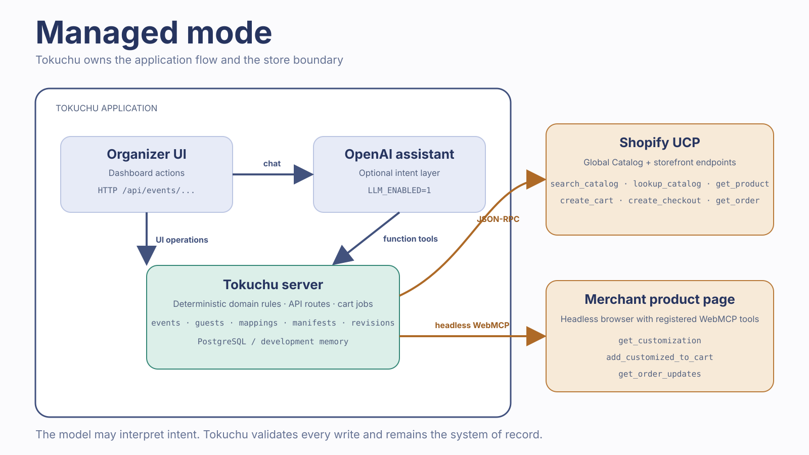
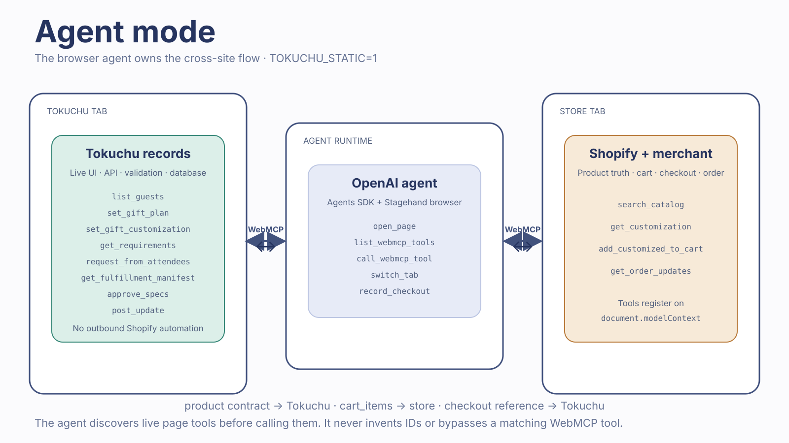

# Tokuchu architecture

Tokuchu has one data model and two ways to coordinate the same procurement workflow. The runtime mode changes who crosses into Shopify. It does not change who owns the records.

## The two configurations

| | Managed mode | Agent mode |
| --- | --- | --- |
| Start command | `npm run dev` | `TOKUCHU_STATIC=1 npm run dev -- -p 3114` |
| Organizer interface | Tokuchu dashboard and optional assistant | Browser agent operating the Tokuchu and store tabs |
| OpenAI | Optional in-app assistant when `LLM_ENABLED=1` | External agent runtime chooses page tools |
| Store boundary | Tokuchu calls Shopify UCP and opens merchant pages in a headless browser | The browser agent calls tools on the store page directly |
| Tokuchu's role | UI, orchestration, validation, and system of record | Record database, validation, and WebMCP tool surface |
| Cart fill | Tokuchu starts it after approval | The browser agent carries `cart_items` to the store |

“Static mode” in environment variables and source comments means **agent mode**. Only outbound store automation is disabled. Tokuchu's pages, API routes, event records, validation, and WebMCP tools remain live.

## Managed mode

The organizer works in Tokuchu's UI. With `LLM_ENABLED=1`, the Assistant panel sends the organizer's message to an OpenAI Agents SDK agent. The agent can read and update the event through deterministic server functions, but it cannot approve an order or check out. The dashboard remains usable without the agent.

Tokuchu performs store-side work on the server:

1. Shopify UCP tools find products and test delivery.
2. A headless merchant page exposes WebMCP tools for product customization.
3. Tokuchu maps store requirements to event and attendee records.
4. Approval starts a cart job that calls the store's cart tool.
5. Tokuchu stores the checkout URL and procurement status.

The principal external tools are:

- Shopify UCP: `search_catalog`, `lookup_catalog`, `get_product`, `create_cart`, `create_checkout`, and `get_order`.
- Merchant WebMCP: `get_customization`, `add_customized_to_cart`, and `get_order_updates`.
- In-app assistant functions: event, guest, requirement, mapping, manifest, request, and scheduling operations. These wrap Tokuchu's deterministic domain functions rather than browser page tools.

## Agent mode

A browser agent owns the cross-site workflow. Tokuchu does not search Shopify, open merchant pages, or fill a cart. It serves the records and the operations that are valid for the current page.

The agent discovers tools from `document.modelContext` in each tab:

1. On Tokuchu it reads guests and stores the gift plan.
2. On the store it calls `get_customization`.
3. Back on Tokuchu it stores the customization contract, maps requirements, requests missing answers, reads the manifest, and approves its revision.
4. On the store it passes the manifest's `cart_items` to `add_customized_to_cart`.
5. Back on Tokuchu it records the returned checkout URL with `post_update`.

Tokuchu page tools include `list_guests`, `set_gift_plan`, `set_gift_customization`, `get_requirements`, `set_personalization_mapping`, `request_from_attendees`, `list_missing`, `get_fulfillment_manifest`, `approve_specs`, and `post_update`. The store page supplies `get_customization`, `add_customized_to_cart`, and `get_order_updates`.

`search_gifts`, `send_to_vendor`, and `approve` are deliberately absent from Tokuchu's page tool list in agent mode because they imply server-side store work.

## Shared record and access layer

Both modes use the same domain and persistence path:

- Tokuchu owns events, guests, RSVP answers, gifts, mappings, requests, revisions, manifests, grants, exceptions, and procurement updates.
- Shopify owns products, variants, carts, checkout, and orders.
- Each event is committed as one serialized document in PostgreSQL. Development falls back to in-process memory when `DATABASE_URL` is absent.
- The attendee invite page exposes `submit_rsvp` with a schema derived from that attendee's current questions.
- The store handoff page exposes only the tools allowed by its grant. Grant scope is checked on every JSON-RPC call to `/api/events/{id}/mcp`.

The central page-tool catalog is `src/webmcp/tools.ts`. Browser registration is in `src/webmcp/register.ts`. Token-authenticated dispatch is in `src/server/mcp.ts`.

## Transport is separate from runtime mode

WebMCP, MCP JSON-RPC, and Shopify UCP are transports. They do not determine which runtime mode is active.

| Transport | Endpoint or surface | Purpose |
| --- | --- | --- |
| Browser WebMCP | `document.modelContext` | Discover and invoke tools registered by the current Tokuchu or store page |
| Tokuchu MCP | `/api/events/{id}/mcp` | Invoke grant-scoped Tokuchu operations with a bearer token |
| Shopify UCP | `catalog.shopify.com/api/ucp/mcp` and `{shop}/api/ucp/mcp` | Search products and operate standard Shopify carts through JSON-RPC |
| Tokuchu HTTP API | `/api/events/...` | Back the UI and the page tools with the same server operations |

For setup and launch instructions, see [Run Tokuchu in agent mode](agent-mode.md). For the exact operation-to-route mapping, see [WebMCP routing](webmcp-routing.md). For the exhaustive browser-agent sequence, see [Agent playbook](agent-playbook.md).
