# Using Tokuchu

This guide walks an organizer through Tokuchu from sign-in to a filled store cart and through the store's side of the order, and names the WebMCP tool each screen calls. WebMCP is the browser standard that lets a page register tools an agent can call through `document.modelContext`. The storefront's pages carry Shopify's commerce tools and the store's own `get_customization` and `add_customized_to_cart`; Tokuchu's pages carry the RSVP records, the invite's reply tool, and the store-facing tools a grant allows. Every call the server makes or answers lands in the Agent trace (section 16).

The app runs in two ways. In normal mode, the mode this guide shows, the organizer clicks through the screens and the server does the store work itself: it searches the catalog and opens the store's product page in a headless browser to call `get_customization` and `add_customized_to_cart`. In static mode (`TOKUCHU_STATIC=1`) the server makes no search and opens no store page; every capability is a WebMCP tool on a page, and an agent in the browser or in a terminal with a browser tool moves between Tokuchu's pages and the store's page itself. `docs/agent-playbook.md` is the prompt and the order of operations for that agent, and `scripts/agent-playbook.mjs` plays it without a model.

Both modes run the same fourteen arrows between the agent, the Tokuchu tab, and the Customworks tab; in normal mode the server and the organizer's buttons stand in for the agent. Each section below that corresponds to an arrow names it by number, and the store's side (sections 12 to 15) follows the second sequence in `docs/diagrams/store-sequence.mmd`. The source is `docs/diagrams/agent-sequence.mmd`.

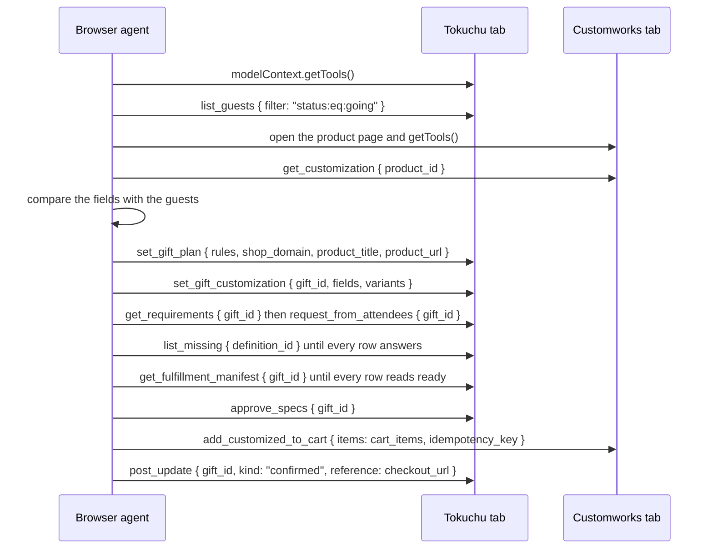
```mermaid
sequenceDiagram
    participant A as Browser agent
    participant T as Tokuchu tab
    participant C as Customworks tab
    A->>T: modelContext.getTools()
    A->>T: list_guests { filter: "status:eq:going" }
    A->>C: open the product page and getTools()
    A->>C: get_customization { product_id }
    A->>A: compare the fields with the guests
    A->>T: set_gift_plan { rules, shop_domain, product_title, product_url }
    A->>T: set_gift_customization { gift_id, fields, variants }
    A->>T: get_requirements { gift_id } then request_from_attendees { gift_id }
    A->>T: list_missing { definition_id } until every row answers
    A->>T: get_fulfillment_manifest { gift_id } until every row reads ready
    A->>T: approve_specs { gift_id }
    A->>C: add_customized_to_cart { items: cart_items, idempotency_key }
    A->>T: post_update { gift_id, kind: "confirmed", reference: checkout_url }
```

| Who exposes it | Tool | What Tokuchu does with it |
|---|---|---|
| Shopify, on every storefront and at the Global Catalog endpoint | `search_catalog`, `get_product`, `get_cart`, `update_cart` and the rest of the catalog and cart set | Finds products across stores and reads their variants and delivery terms |
| Customworks, the demo store built for this project, on its product pages | `get_customization` | Reads the fields a personalized product needs and the limits on each |
| Customworks, on its product pages | `add_customized_to_cart` | Adds one configured unit per attendee to the store's cart and returns the checkout link |
| Tokuchu, on the organizer's event page | `list_guests`, `set_gift_plan`, `set_gift_customization`, `get_requirements`, `request_from_attendees`, `list_missing`, `get_fulfillment_manifest`, `approve_specs` and the rest of the organizer list (23 tools in normal mode; `search_gifts`, `send_to_vendor`, and `approve` leave in static mode) | Lets an agent read the RSVP list, hand it the store's payload, and run the same steps this guide clicks through |
| Tokuchu, on the attendee's invite page | `submit_rsvp` | Lets an attendee's agent reply and answer the product's questions |
| Tokuchu, on the store-facing page a grant's signed link opens | `get_procurement`, `get_fulfillment_manifest`, `get_requirements`, `get_changes`, `acknowledge_changes`, `get_updates`, `post_procurement_update`, each registered only when the grant's permissions allow it | Lets a store's agent read the manifest at the approved revision, post the order's progress, post an exception on a value it cannot use, and record how far it has read |

The screens below come from `scripts/capture-guide.mjs`, which drives a local server through the whole flow against the live demo store, and from the acceptance run in `tests/acceptance.spec.ts` for the store's side (sections 12 to 15).

## 1. Sign in

Open the site and choose Sign in. Enter your email address and send the link. A first sign-in creates your account; there is no password. The link opens the page you came from, or your events list.

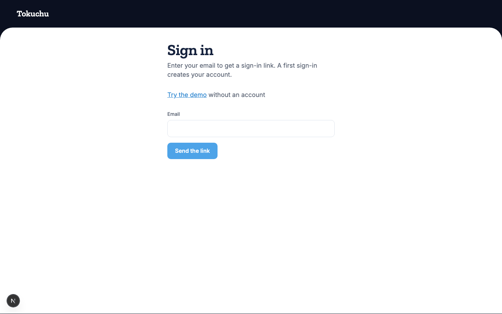

Two other ways in:

- **Try the demo** runs the whole flow as a guest on a seeded event, with a guided tour and no account. The guest's event is kept when the guest creates an account from the band.
- **A denied address** lands on the not-found page with a link to the demo. The deployment can restrict sign-in to a list of organizer addresses; when it does, an address outside the list is denied.

An attendee never signs in. Their invite link opens without a session.

## 2. Your events

Your events lists the events your account owns and nothing else; each account sees only its own. Create a new event opens the form.

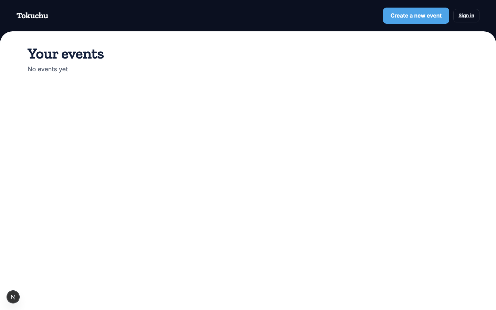

## 3. Create the event

The form holds the details attendees see, the venue the gifts are delivered to, and the date they are needed by. The venue address matters twice: the invite shows it, and every catalog search checks that a product ships to it in time.

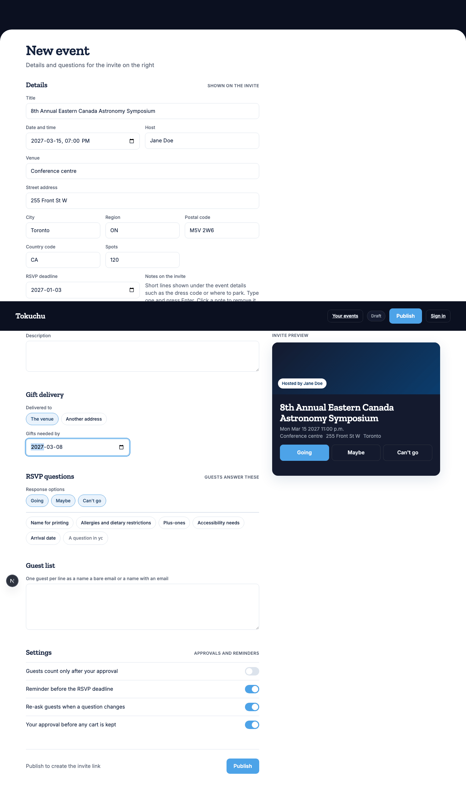

- **Title, date, host, description** appear on the invite.
- **Venue** is the delivery address. The fields accept the browser's address autofill.
- **Spots and RSVP deadline** feed the counts on the overview.
- **Notes on the invite** are short lines under the details, such as the dress code or where to park. Type one and press Enter; click a note to remove it.
- **Needed by** is the date the gifts must arrive. A search excludes any product whose delivery window ends after it.

Publish creates the invite link.

## 4. The overview

The event page has three tabs. Overview shows the counts, the invite link, the guest list, the follow-ups the replies still need, and the gifts chosen so far.

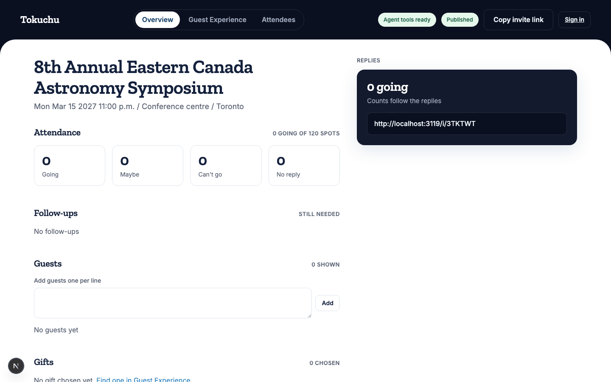

- **Copy invite link** copies the link every attendee replies through.
- **Guests** takes one name per line, or `Name <email>`, or a bare email. A listed guest who replies updates their own row instead of adding one.
- **Agent tools ready** in the band means the page has registered Tokuchu's organizer tools over WebMCP. An agent in the browser lists them with `getTools` (arrow 1) and reads the guest list with `list_guests` (arrow 2); the Attendees tab lists them.
- **Gifts** links to Guest Experience while none is chosen.

## 5. What an attendee sees

The invite link opens the event with a reply form. The attendee gives a name, an email address, and a reply, then answers whatever questions the organizer has asked so far. The email is required for anyone going or maybe going, because a later request for a missing detail is sent there.

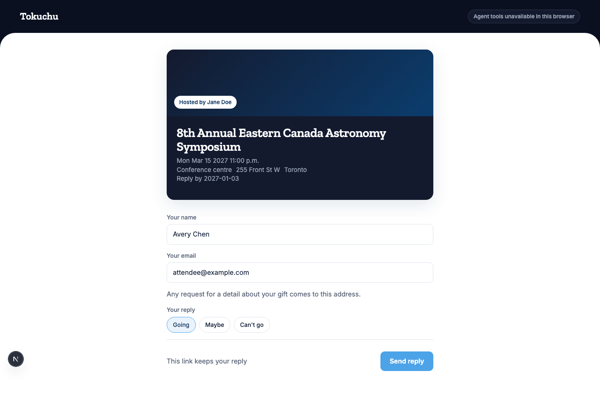

The same form registers as the WebMCP tool `submit_rsvp` on this page. Its input schema lists one property per question with the store's limits, so an attendee's browser agent can answer without touching the form. Each answer is one of the replies arrow 9 waits for. The link keeps the reply: opening it again shows the saved answers and lets the attendee change them or cancel.

## 6. Search the catalog over Shopify's UCP endpoints

Guest Experience starts with a search. Pick a card or describe the item in a sentence.

The search calls `search_catalog` on Shopify's Global Catalog endpoint and on the demo store's own endpoint, with the venue's address as the shipping context. Both are UCP endpoints, MCP over HTTP from Tokuchu's server; no WebMCP is involved until a store's page is open in a browser. The funnel under the heading shows each call: the query, how many products it returned of how many the catalog holds, and the price ceiling it searched under. Distinct products are merged across the calls, and the best candidates get a delivery check against the venue and the needed-by date.

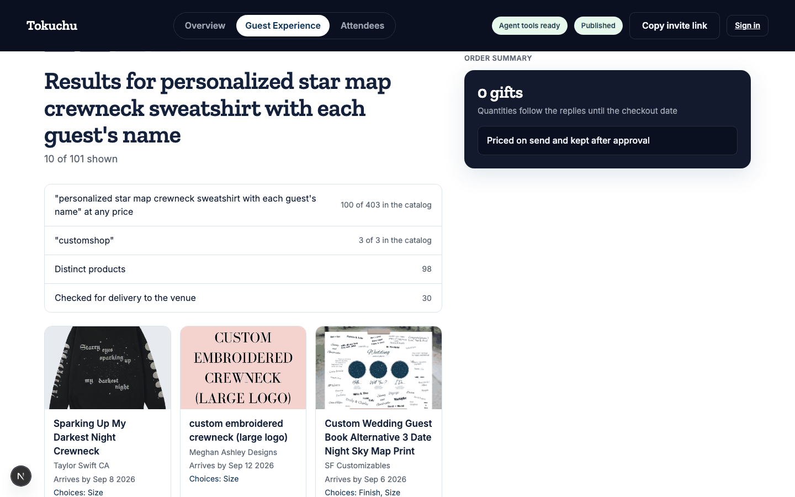

The results are ranked real products from real stores. Each card names the store and, when the delivery check passed, the date the product arrives by.

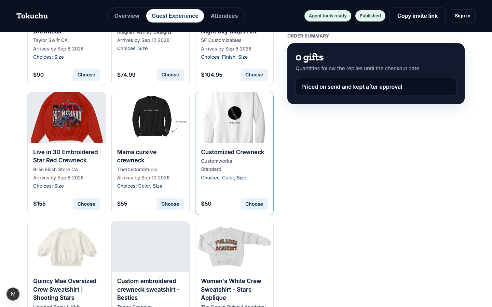

## 7. Pick the products and read their customization

The demo chooses three gifts: the store's crewneck, the store's ceramic mug as the favour, and a food and beverage item from Shopify's catalog. Click a result. The next step chooses who receives it, by default everyone going.

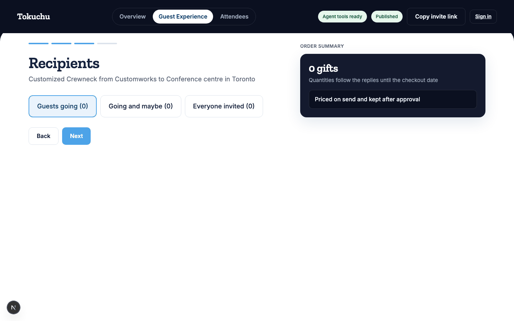

The step after maps a choice question to the product's variants and sets a default for anyone who has not answered, a rule for a missing required answer, and what happens to a unit whose attendee cancels after checkout.

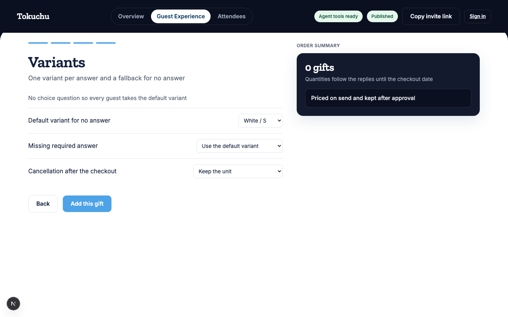

Add this gift is where the store's own WebMCP tool comes in. For the demo store, Tokuchu opens the product page on the server, lists its tools (arrow 3), and calls `get_customization` (arrow 4). The store answers with the fields the product needs, each with its kind and limits, and with the variants it sells. Those land on the gift through the same path an agent takes with `set_gift_plan` (arrow 6) and `set_gift_customization` (arrow 7). Tokuchu holds no field list of its own for any product; the store's answer is the only source.

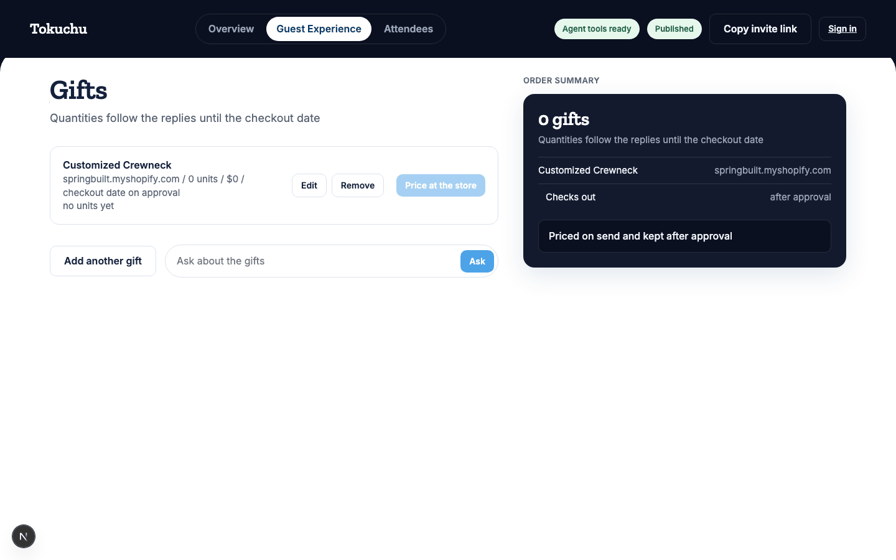

The mug goes the same way: Back to the results reopens the last search, whose list keeps the store's eligible products, and the store answers `get_customization` with one field, an image each attendee supplies as the address of a picture.

For a product from any other store the catalog's variants stand in, and there is no customization step. The food and drink card runs its searches in Shopify's food and beverage category and checks that each product ships to the venue by the needed-by date; the first result whose delivery check passed is a plain product, and its order goes through the store's own UCP cart at approval.

## 8. Request the missing details from attendees

The Attendees tab shows one gift at a time; with more than one gift a row of buttons at the top switches between them. For the gift shown it compares the store's fields with what the RSVP list already holds (arrow 5). A field that matches an existing answer, such as the printed name, is resolved from the list. The rest are shown as questions to ask; `get_requirements` returns the same list with the source of each (the first half of arrow 8).

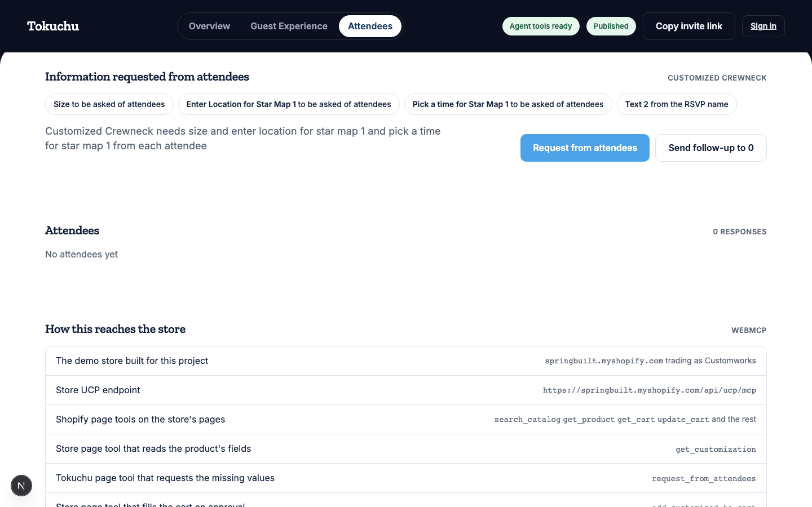

Request from attendees turns each open field into a question with the store's limit or choices, and emails every going attendee who lacks an answer a link to their own reply form. The band's tool list names this step `request_from_attendees` (the second half of arrow 8), and an agent can run it the same way.

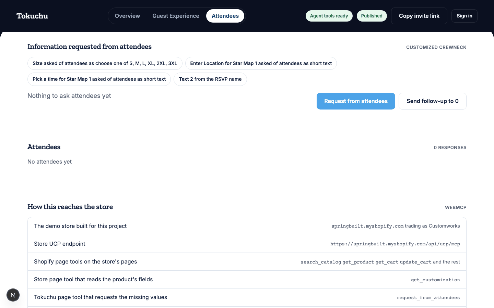

Send follow-up emails everyone whose request still has an unanswered question; an agent reads the same set through `list_missing` (arrow 9) until it names no one. An attendee with no email address is listed as such; they add one by opening their reply link again.

The mug's image field becomes a file question: the form takes the address of a picture, and the store's cart tool takes an https address or an image data URL. The food gift has no fields, so its panel reads that there is nothing to ask.

## 9. The records grid and the routing

Each reply fills a row: one column per requirement of the gift shown, with the attendee's answer or a marker for what is still missing. The grid is `get_fulfillment_manifest` drawn as a table (arrow 10), and approval opens when every row reads ready. Switching the gift switches the columns. An answer changed after approval is marked so you can re-approve.

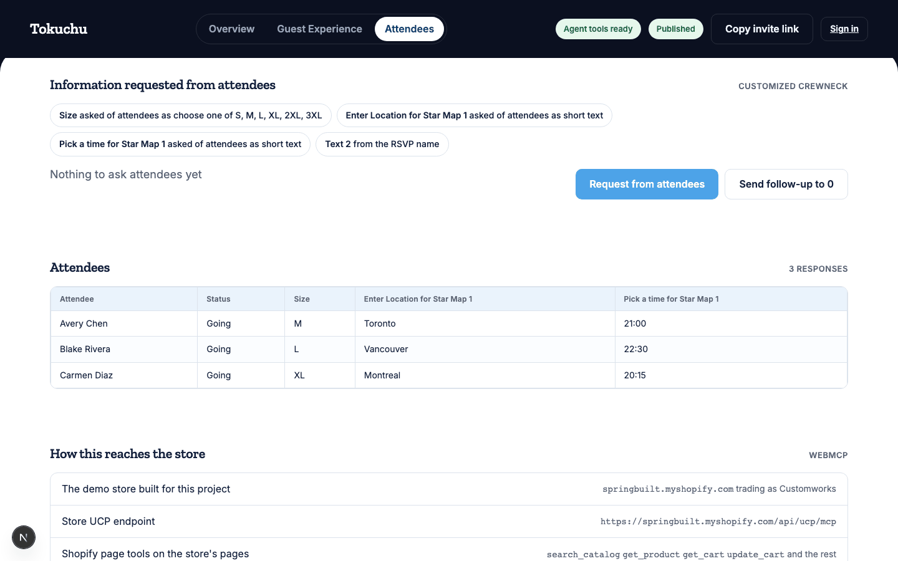

Under the grid, How this reaches the store lists every hop for this gift, the UCP endpoint calls and the WebMCP page tools: the store, its endpoint, the Shopify page tools on its pages, the store's `get_customization` and `add_customized_to_cart`, and Tokuchu's own `request_from_attendees`. For a plain product the panel names `approve_specs` and the store's UCP cart tools `create_cart`, `update_cart`, and `create_checkout` instead.

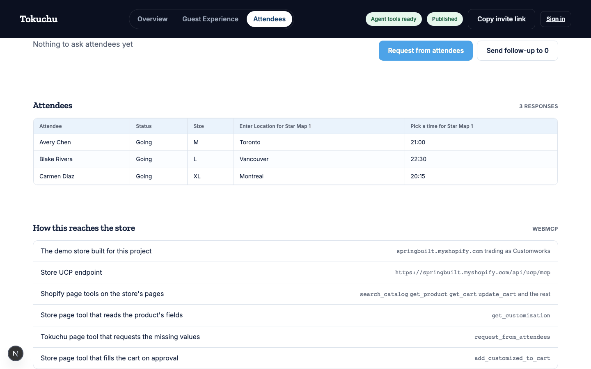

## 10. Approve and fill the carts

Approve and fill the cart records the approval of the gift shown (`approve_specs`, arrow 11) and starts its cart job; each gift is approved on its own. For the crewneck and the mug Tokuchu opens the store's product page on the server and calls `add_customized_to_cart` once (arrow 12), with one item per attendee: the variant their size resolved to and their values for every field. The store adds the lines to a cart and returns its checkout link, which appears under the approval and in the gift's progress log (`post_update`, arrow 13). For the food gift Tokuchu calls the store's UCP endpoint instead: `create_cart` with one unit per attendee going, then `create_checkout`, and the checkout link appears in the same place.

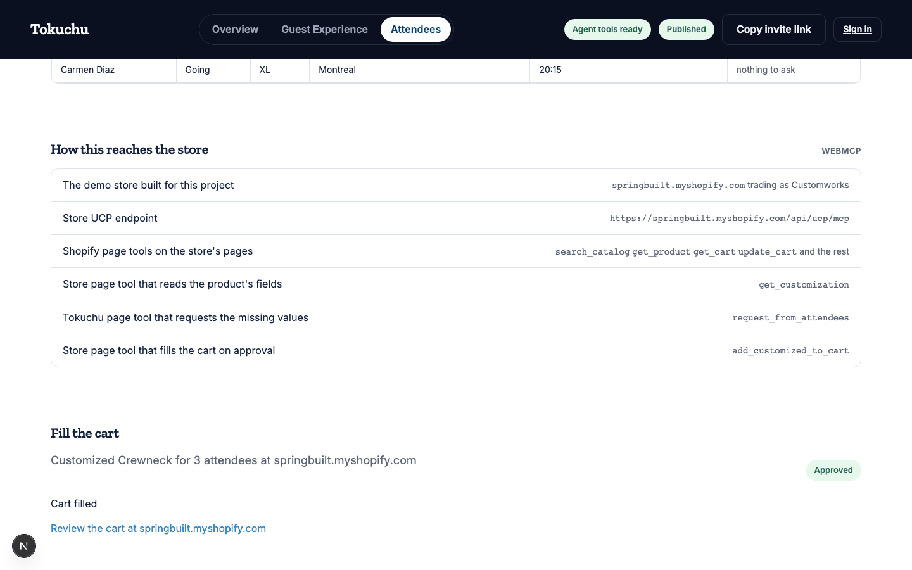

A row that is not ready is listed under the button with the reason. When attendees have not confirmed their specifications yet, a Send email reminders button is beside the message; when a field was never requested, the request button is.

## 11. Review the carts at the stores

Three gifts from two stores give three links. The crewneck's and the mug's open the store's cart in any browser, with a personalized line per attendee; the food's opens its store's checkout with the going count. Checkout happens at each store, with the store's own payment.

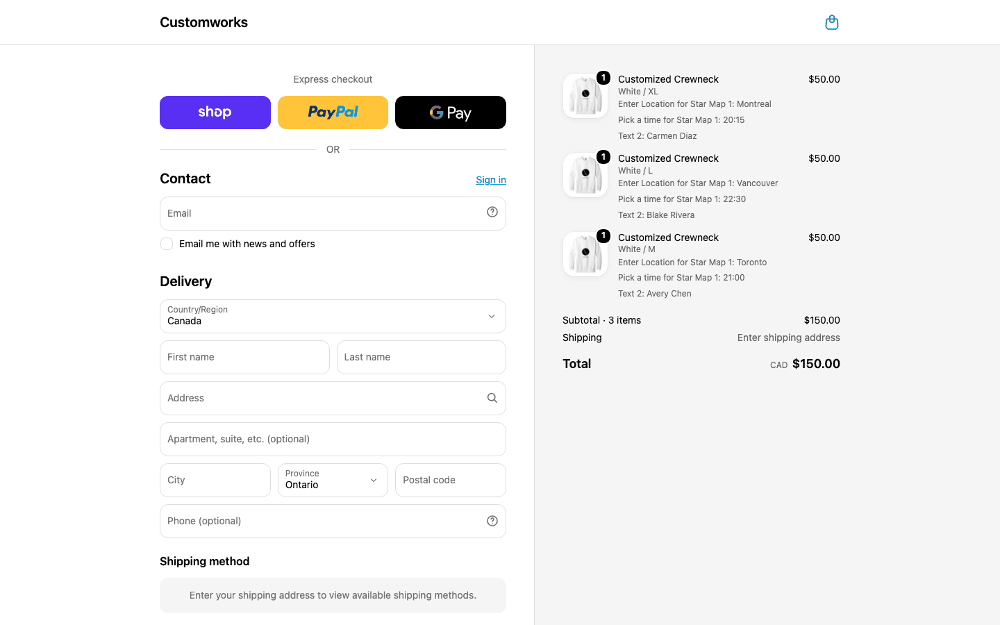

## 12. Give the store access to the fulfilment data

The store that fills a personalized order needs the manifest, and its agent may find a value it cannot use. Share fulfilment data, under Fill the cart on the Attendees tab, creates that access for the gift shown. The store name is read from the gift. The four checkboxes are the kinds of access the grant carries: the attendee fields the gift's requirements map, the fulfilment manifest, the change log, and the updates thread with the right to post. Access ends when the order is fulfilled, or on a date you pick.

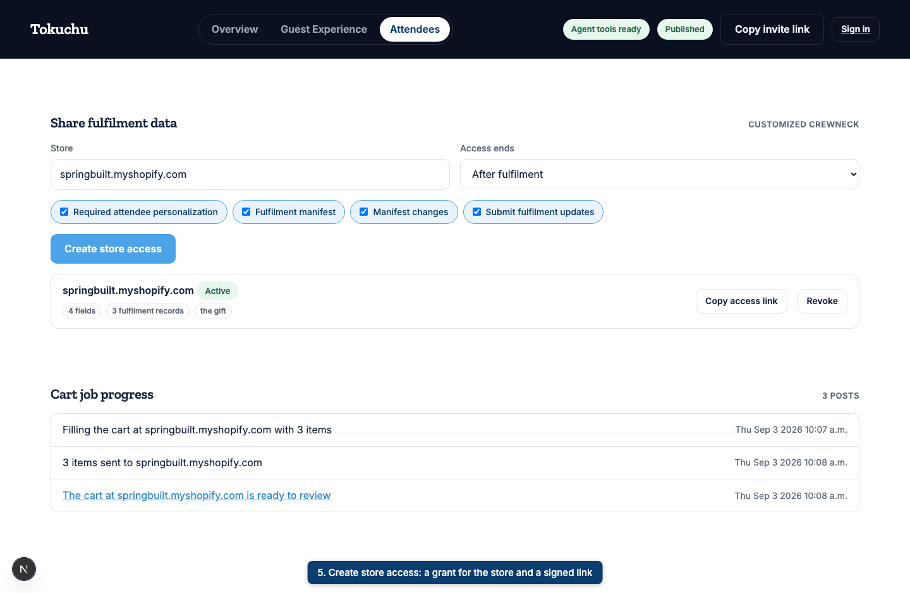

Create store access records the grant and lists it as Active with what it reaches: the fields, the fulfilment records, and the gift. Copy access link copies a signed link, the first arrow of the store's sequence. The link is the store's only credential; there is no store account. Revoke ends it at once, and a store page open at that moment gets the revocation on its next call.

## 13. What the store's agent sees

The signed link opens Tokuchu's store-facing page for the grant: the Procurement with its status and its current and approved revisions, the requirement schema, the requirements, the fulfilment manifest, the open exceptions, the updates, and a form to post an update. The page registers the grant's tools over WebMCP, so a store's agent lists them with `getTools` (store arrow 2) and calls them through `document.modelContext` the way the organizer's agent calls the event page's.

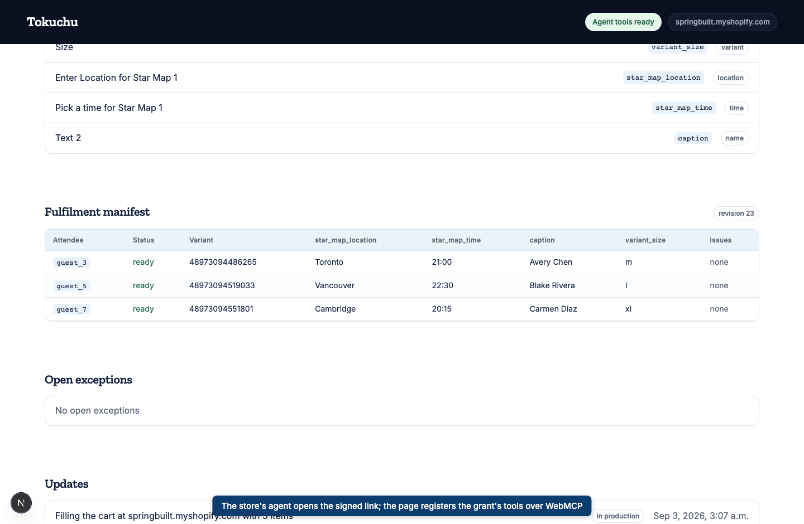

`get_fulfillment_manifest` (store arrow 3) returns one row per attendee with the attendee reference, the row's status, the variant, and the values keyed by the store's own requirement keys: for the crewneck the size, the star map location and time, and the printed name. Nothing else about the person leaves Tokuchu; the manifest carries no email address and no answer the grant does not name. The rows read at the revision the organizer approved, and the manifest states both revisions.

## 14. The store raises an exception

When a value cannot be used, the store's agent posts a typed update through `post_procurement_update` (store arrow 4): `needs_information` names the attendee and the requirement with a question, `invalid_value` sends a value back, and `option_unavailable` names the value the store cannot supply and what it offers. In the demo one attendee gave "Cambridge" for the star map location, and the store's agent asks which one.

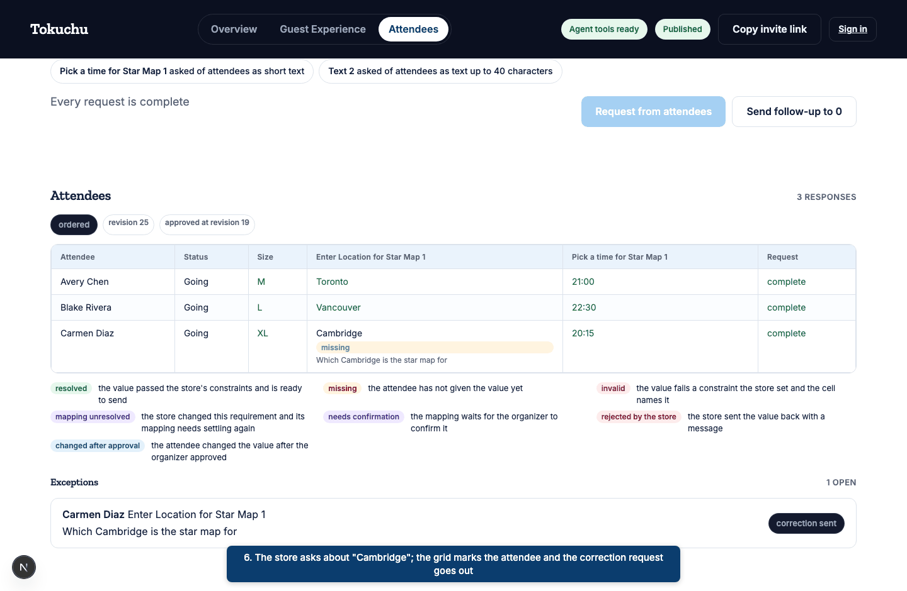

The post opens an exception on the Procurement and moves its revision on. On the Attendees tab the attendee's cell reads missing with the store's question under it, the exceptions list under the grid carries the attendee, the requirement, the message, and the correction request's state, and the attendee gets an email with the store's question quoted and a link to their reply form.

## 15. The correction and the new revision

The attendee opens the reply link and saves the full place name. The answer resolves the exception, the correction reads answered, and the cell reads changed after approval, because the organizer's approval stands at the earlier revision. The store's agent reads what changed through `get_changes` (store arrow 5) with the revision it approved at: the exception, the attendee's answer, and the resolution, each with its revision.

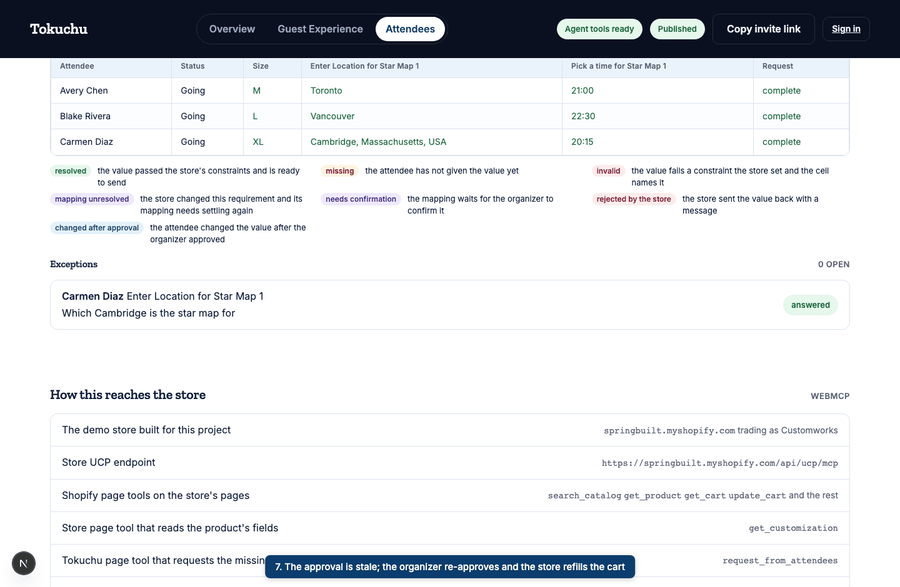

Re-approve records the approval at the new revision and runs the cart job again: `add_customized_to_cart` fills the store's cart with the corrected line and returns a fresh checkout link. The demo tour walks the same store steps after the approvals, with the store's page in a frame beside the callout.

## 16. The agent trace

Every WebMCP and UCP call Tokuchu's server makes or answers is recorded on the event: the catalog searches and the delivery probes, the store page's `get_customization` and `add_customized_to_cart`, the store's UCP cart and checkout calls, each call a token holder makes at the MCP endpoint, and each tool the assistant runs. One entry holds the side that answered (Tokuchu, the store, or the catalog), the transport, the endpoint or page it went to, the tool, a short summary of the arguments and the result, whether it succeeded, and how long it took. A summary keeps the top-level values and the shapes of nested ones, so an attendee's row never lands in it.

Agent trace in the band opens the drawer on any tab. On a wide screen it is a column beside the sheet, after the assistant's column when both are open; on a narrow screen it opens over the page and Close collapses it. The entries arrive newest first with the four-second poll, and each one expands to where it went and what it carried.

Guest Experience shows the same entries where they belong: the last calls of a search under the results heading, and the last calls about a gift under the gift in the list. The store-facing page shows the calls about its order, including the posts the store itself made through the endpoint.

A catalog call that fails leaves a row in the search funnel naming the error and a failed entry in the trace; the other searches' products stand and the search still returns them.

## When something looks wrong

- **A search shows 0 of 0 in the catalog.** The catalog answered with nothing for that query and ceiling. Try a broader sentence.
- **The server answered without a reply, or the connection dropped.** The instance was restarting, which happens on every deploy. Wait a minute and press the button again. A gift may have saved before the reply was lost; the list refreshes to show it.
- **No email address** beside a request means the attendee replied without one. Their reply link lets them add it; the next follow-up then reaches them.
- **Agent tools unavailable in this browser** means the browser has no WebMCP support and the page did not load the polyfill. The buttons still work; only the agent path is off. Adding `?webmcp=polyfill` to the event URL loads the polyfill.
