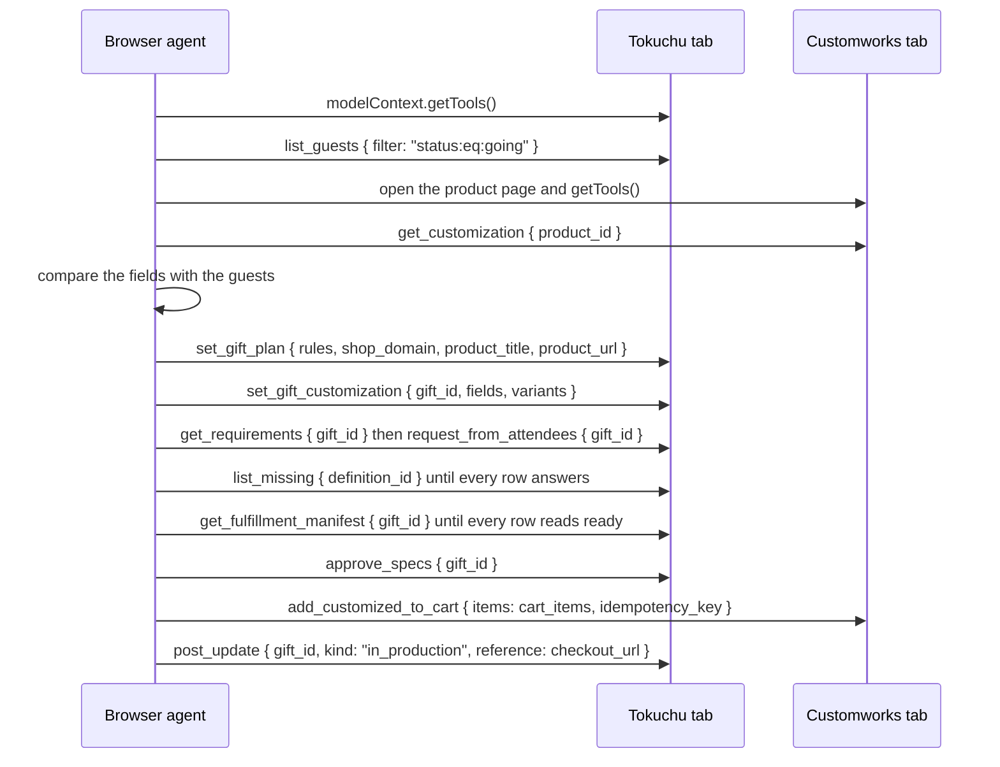
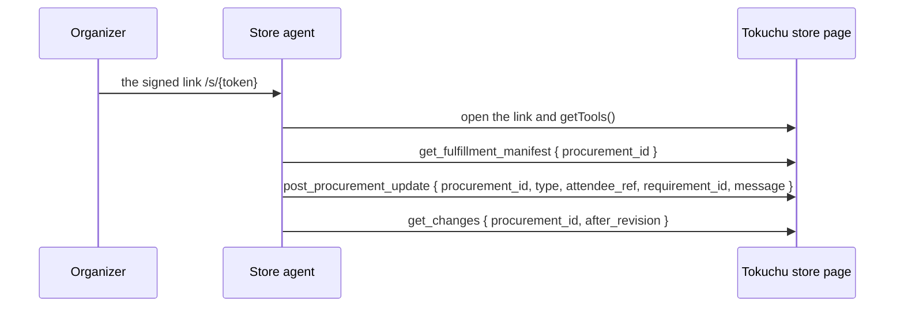

# Tokuchu: agentic event procurement over WebMCP

## 1. Summary

Tokuchu is an event procurement system that uses attendee information and WebMCP-enabled storefronts to coordinate personalized purchases for events. WebMCP lets a web page publish tools: functions with a name, a description, and a JSON Schema for their input, registered on the page's model context, which an agent discovers and calls. Shopify's storefronts publish such tools on every page and answer the same calls over HTTP at each store's UCP endpoint. Tokuchu publishes the RSVP list and the order's records as tools of its own, so one agent drives two pages: the store's product page and Tokuchu's event page.

The order begins with an RSVP list containing attendees and the information associated with them. The agent reads the store's own WebMCP tool, `get_customization`, on the product page; it returns the customization requirements for the selected product in structured form, so Tokuchu holds no predefined field list for any product. The agent hands that payload to Tokuchu through `set_gift_customization`. Tokuchu compares the requirements with the information already associated with each attendee, determines which required values are missing for each attendee, and sends each attendee a request for those values by email. Responses return to Tokuchu and attach to the attendee record; Tokuchu tracks who has completed the request and follows up where information remains missing. Once every unit's values are complete, the agent approves, and the approval records the change-log revision it stands at. The agent takes the cart items Tokuchu prepares back to the store's page and calls the store's `add_customized_to_cart` tool, which adds one configured item per attendee to the store's cart through Shopify's cart endpoint and returns the checkout link. The organizer inspects the cart and completes checkout.

After approval the organizer shares the fulfilment data with the store through a signed link. The link opens a store-facing page that registers the tools the grant allows, so the store's own agent reads the manifest at the approved revision, posts the order's progress, and posts an exception on a value it cannot use. An exception routes a correction request to the attendee, and the store reads the correction through `get_changes`.

The product is designed around event-scale personalization. The organizer makes one procurement decision for an event, and Tokuchu handles the individualized information required to configure the corresponding item for each attendee. The core behavior in one line:

```
Read what the merchant needs on the store's page
→ hand it to Tokuchu
→ collect those values from the right attendees
→ approve at a revision and fill the store's cart with the completed data
→ let the store read the manifest and post exceptions through a signed link
```

Tokuchu is built against one specific demo site: a live Shopify store, deployed as a separate component of the project, whose theme carries the merchant tools and whose celestial-map shirt and ceramic mug the demo orders (Section 6). In normal mode Tokuchu's server also runs the store's side itself: it searches the catalog and opens the store's product page in a headless browser to call the merchant tools, so an organizer clicking through the screens needs no agent. In static mode (Section 12) the server opens no store page, and a browser agent, or a terminal agent with a browser tool, runs the order across both pages from the playbook in `docs/agent-playbook.md`. Tokuchu deploys on Render with a Postgres database and a magic-link sign-in.

## 2. Conventions

- **WebMCP** names the browser API by which a page registers tools on `document.modelContext` (or `navigator.modelContext`) with `registerTool`, and an agent lists them with `getTools` and runs one with `executeTool`. A browser with native support provides the model context; otherwise a polyfill script loaded before the page's own scripts provides it.
- A **tool** names one registered function: a name, a description, an input schema in JSON Schema, an optional output schema, and an execute function. A **tool call** names one invocation with arguments that fit the input schema, returning content and structured content.
- An **agent** names the caller of tools. In this document the agent is a browser agent acting on Tokuchu's pages and the store's page, Tokuchu's server driving a headless browser page in normal mode, Tokuchu's curation agent running a language model with tool wrappers, or the store's agent acting on the store-facing page.
- A **store** names a Shopify storefront that publishes WebMCP tools. Its **page tools** register on every page's model context. Its **UCP endpoint** at `{shop}/api/ucp/mcp` answers the same tool calls as JSON-RPC from a server.
- A **merchant tool** names a page tool the merchant adds to the theme beyond Shopify's own: `get_customization` and `add_customized_to_cart`.
- A **customization requirement** names one value the merchant needs to make a unit, as `get_customization` states it: key, label, kind (text, name, location, date, time, image), required flag, and constraints (a maximum length, an allowed set). A **requirement schema** names the set of requirements for one product with an id and a version; a version changes when a key, a kind, a required flag, or a constraint changes.
- A **record** names a row in Tokuchu's database. A **question** names an `AttributeDefinition` record: one value Tokuchu asks an attendee for, with a value type and constraints. An **answer** names an `AttributeValue` record for one attendee and one question.
- A **source** for a requirement names where its value comes from: an answer the attendee gave, a field of the event (the venue, the date), a field of the guest record (the display name), or a literal the organizer typed.
- A **request** names the set of questions Tokuchu sent to one attendee, with the time it was sent and the answered state of each question.
- A **unit** names one configured item for one attendee: a variant plus a value per requirement.
- A **procurement** names one gift's order as the store sees it: a status, a current revision, an approved revision, and a requirement schema id and version. Until a `Procurement` record exists the gift stands as the procurement and its id serves as `procurement_id`.
- A **revision** names the sequence number of the last change-log entry a caller may see for a procurement. Every write that affects the procurement appends one entry, so the revision rises with each change.
- A **grant** names an `AccessGrant` record: which outside party may reach which procurement, with what permissions, and which questions it may read. A **token** names a `CallerToken` that a grant authorizes.
- An **exception** names a `ProcurementException` record the store opens on a value it cannot use, open until the attendee's next answer on that requirement resolves it.
- **Normal mode** names a server that runs the store's side itself. **Static mode** names a server started with `TOKUCHU_STATIC=1`, which makes no catalog search and opens no store page.
- Money appears in minor units as Shopify returns it. Dates use ISO form.

## 3. The WebMCP uses

The order uses WebMCP in four connected parts of the same workflow.

1. **Product discovery.** Shopify's storefront tools answer `search_catalog`, `lookup_catalog`, and `get_product` on every store page and at the Global Catalog and at each store's UCP endpoint. An agent finds the product on the store's page. Tokuchu's own catalog search calls the endpoints for an organizer who types a sentence and ranks the results (Section 13).
2. **Product-specific customization discovery.** The selected merchant exposes its own WebMCP tool, `get_customization`, which returns the specific customization inputs the chosen product requires. For the celestial-map shirt this includes the required name, location, and time values and their constraints, such as the name remaining under 20 characters. This merchant tool extends the standard Shopify commerce capabilities with information specific to the merchant's product and fulfillment process, and it lets the merchant communicate its own fulfillment requirements in structured form (Section 9).
3. **Tokuchu's records as tools.** Tokuchu's event page registers the RSVP list and the order's records as tools. The agent hands the store's payload to `set_gift_customization`, reads the source of each requirement through `get_requirements`, runs `request_from_attendees`, reads `get_fulfillment_manifest`, and approves through `approve_specs`. The invite page registers `submit_rsvp` for an attendee's agent, and the store-facing page registers the grant's tools for the store's agent (Sections 8 and 11).
4. **Customized cart creation.** After the required customization data has been collected, the store's `add_customized_to_cart` tool creates the configured cart items through Shopify's cart endpoint. The agent calls it on the store's page with the `cart_items` the manifest returns; in normal mode Tokuchu's server calls it from a headless page (Section 10). The merchant tool wraps Shopify's cart endpoint because Shopify's own cart tools carry a variant and a quantity per line and no text (Section 5).

**The sequence.** The order runs as thirteen arrows between a browser agent, a Tokuchu tab, and a Customworks tab; each arrow is one WebMCP call, and `README.md`, `docs/agent-playbook.md`, and `docs/guide.md` number them the same way. The source is `docs/diagrams/agent-sequence.mmd`.

1. The agent calls `getTools` on the Tokuchu tab and receives the event page's tool list.
2. The agent calls `list_guests` with `{ filter: "status:eq:going" }` and receives every attendee who replied going with the answers the RSVP list holds.
3. The agent opens the Customworks product page and calls `getTools`, which lists Shopify's storefront tools and the store's `get_customization` and `add_customized_to_cart`.
4. The agent calls `get_customization` with `{ product_id }` and receives the product's fields with their kinds and limits and the variants with their ids.
5. The agent compares the fields with the guests to see which fields the RSVP list already fills and which the attendees must answer.
6. The agent calls `set_gift_plan` with `{ rules, shop_domain, product_title, product_url }` and receives the gift with its `id`.
7. The agent calls `set_gift_customization` with `{ gift_id, fields, variants }`, and Tokuchu records the store's payload as the gift's requirement schema (Section 9).
8. The agent calls `get_requirements` with `{ gift_id }`, which names the source that fills each requirement, then `request_from_attendees` with `{ gift_id }`, which sends every going attendee who lacks an answer a request for those values by email.
9. The agent calls `list_missing` with `{ definition_id }` until every row answers; each reply names the attendees who still owe a value for one question.
10. The agent calls `get_fulfillment_manifest` with `{ gift_id }` until every row reads ready; the reply carries one graded row per attendee and the `cart_items` for the store (Section 10).
11. The agent calls `approve_specs` with `{ gift_id }`, and the approval records the change-log revision it stands at (Section 11).
12. The agent calls `add_customized_to_cart` on the Customworks tab with `{ items: cart_items, idempotency_key }`, and the store adds one cart line per attendee and returns the `checkout_url`.
13. The agent calls `post_update` with `{ gift_id, kind: "in_production", reference: checkout_url }`, and the gift's progress log carries the checkout link for the organizer to review and pay.



**The store's sequence.** After the thirteenth arrow the store's own side runs as a second sequence (`docs/diagrams/store-sequence.mmd`, Section 11). The organizer sends the store a signed link. The store's agent opens the link, which lands on the store-facing page, and calls `getTools` for the tools the grant allows. The store's agent calls `get_fulfillment_manifest` with `{ procurement_id }` and receives one row per attendee at the approved revision. The store's agent calls `post_procurement_update` with `{ procurement_id, type, attendee_ref, requirement_id, message }` to move the order on or to open an exception on a value it cannot use, and an exception routes a correction request to the attendee. The store's agent calls `get_changes` with `{ procurement_id, after_revision }` and reads the correction and every other change since the revision it last read.



## 4. The organizer and the loop

The organizer runs a recurring event, such as an annual symposium, and orders one personalized item per attendee. In one week the organizer publishes the event, chooses the item, and collects answers as replies arrive. A wrong name or size on a unit costs a reprint and a late delivery, so every answer records who gave it and when.

The loop the organizer runs:

1. **Sign in and create the event.** The organizer sets the title, the date, the venue, the spots, the RSVP deadline, and the delivery target, then publishes. Publishing creates the link attendees reply through.
2. **Find the product.** The organizer types a sentence such as "personalized star map crewnecks with each attendee's name", and the catalog search shows ranked products with the store each came from. In static mode the agent finds the product on the store's page instead.
3. **Select the vendor and product.** The organizer picks one, or the agent creates the gift from the product with `set_gift_plan`. The store's `get_customization` answers with the requirements the product carries, and Tokuchu records them on the gift as a requirement schema with an id and a version.
4. **Review what will be asked.** Tokuchu shows each requirement with its source: a value the RSVP already holds, a value the organizer maps to an event field, a new question the store's field creates, or a match the organizer confirms between two candidates. The organizer confirms.
5. **Attendees answer.** Each attendee with a missing value receives an email carrying their own link to a form with the fields the selected product requires. The organizer watches the records grid fill, one row per attendee and one column per requirement, and Tokuchu follows up with whoever has not answered.
6. **Approve.** When every row of the fulfilment manifest reads ready, the organizer approves. The approval records the revision it stands at. In normal mode Tokuchu calls `add_customized_to_cart` and shows the checkout link the tool returned; in static mode the agent takes the manifest's cart items to the store's page. An attendee who edits an answer after approval moves the revision on, and the Attendees tab shows the approved revision beside the current one and offers a second approval that fills a fresh cart.
7. **Review and check out.** The organizer opens the link, inspects the populated cart with one line per attendee, and completes the store's checkout. Tokuchu reads the order and its fulfillment state afterward through Shopify's Admin API and shows them on the dashboard.
8. **Share the fulfilment data.** The organizer creates store access on the Attendees tab and sends the signed link to the store. The store's agent reads the manifest, posts accepted and production started and fulfilled as the order moves, and posts an exception on a value it cannot use. The exception reaches the attendee as a correction request, and the organizer re-approves at the new revision once the answer arrives.

## 5. What the store provides

**Shopify's UCP endpoint.** Every surveyed store answers `tools/list` at `{shop}/api/ucp/mcp` with thirteen tools: `search_catalog`, `lookup_catalog`, `get_product`, `create_cart`, `get_cart`, `update_cart`, `cancel_cart`, `create_checkout`, `get_checkout`, `update_checkout`, `complete_checkout`, `cancel_checkout`, `get_order`. Each call carries a link to a public agent profile document. The Global Catalog at `catalog.shopify.com/api/ucp/mcp` answers the same search across stores. Tokuchu's discovery (Section 13) and the cart fill for a plain product (Section 10) call these from the server.

**Shopify's page tools.** The store's pages load Shopify's storefront WebMCP script, which registers ten tools on `document.modelContext`: `browse_store`, `search_catalog`, `get_product`, `show_variant`, `get_cart`, `update_cart`, `cancel_cart`, `proceed_to_checkout`, `manage_orders`, and `search_shop_policies_and_faqs`. The script registers them only when a model context exists before it runs, so a headless driver injects the polyfill first.

**What a Shopify cart line carries.** A UCP line item holds an id, an item, a quantity, and totals. The page tool `update_cart` takes a variant id and a quantity. Neither carries a text value, so a printed name reaches the store through the merchant tool below, which adds the line with Shopify's cart endpoint and the values as line item properties.

**The merchant tools.** The theme registers two more tools on every page:

| Tool | Input schema | Returns |
| --- | --- | --- |
| `get_customization` | `{ product_id }` | the requirements with their kinds and constraints, read from a product metafield the theme exposes, and the live variants |
| `add_customized_to_cart` | `{ items[]: { recipient_ref, variant_id, values }, idempotency_key }` | one cart line per item added through `/cart/add.js` with the values as properties, the line keys, and the cart's `checkoutUrl` |

`add_customized_to_cart` validates every item against the requirements before adding any: an unknown key, a missing required value, or a value over its maximum length returns the item's issues and adds nothing. A repeated call with the same idempotency key adds nothing and returns the recorded lines.

**The shareable cart.** The storefront's session cart resolves as a Storefront API cart, `gid://shopify/Cart/{token}`, whose `checkoutUrl` takes the form `{shop}/cart/c/{token}?key=...`. That URL opens the cart at Shopify's checkout in any browser, with every line and its properties. The live suite `tests/customily-tools-live.spec.ts` builds a cart with two lines in one session and opens the URL in a fresh browser, where both personalized lines show. Cart permalinks carry properties on the first line only, so they cannot express a multi-attendee cart.

**Shopify's Admin API.** Tokuchu reads orders and fulfillment state through the GraphQL Admin API with a client-credentials grant. The store and the app share one Shopify organization. Card data stays with Shopify's checkout.

## 6. The demo store and the interaction between the two components

The project has two deployed components. Tokuchu is the organizer's app. The demo store is a live Shopify store, `springbuilt.myshopify.com`, trading as Customworks, which sells a customizable celestial-map shirt and a ceramic mug with a photo through the Customily app. The store was selected and configured so that the shirt surfaces when the catalog search runs for customizable products: a search for a personalized star map crewneck ranks it within the first page of results from the Global Catalog and the store's own UCP endpoint. The flow is developed, tested, and recorded against this store. Any other WebMCP-enabled store answers discovery and Shopify's own tools; personalization on another store needs that store to publish the two merchant tools.

WebMCP development happens in both components. In Tokuchu it is the tool registry on the event page, the invite page, and the store-facing page, and the MCP endpoint. In the store it is the theme asset that registers `get_customization` and `add_customized_to_cart` on every page, and the product metafield that holds the shirt's requirements: a name limited to 20 characters, a location, and a time for the star map, with six size variants, and the mug's one requirement, an image. Building those tools in the store is part of the project's scope, and a change to the shirt's requirements is a change to the metafield rather than to Tokuchu; Tokuchu reads the change as a new requirement schema version (Section 11).

The interaction between the two runs over WebMCP page tools and Shopify's UCP endpoints:

- **A browser agent across both pages.** The agent opens the store's product page and calls `get_customization`, opens Tokuchu's event page and calls `set_gift_plan` and `set_gift_customization` with the payload, and after `approve_specs` returns to the store's page with the manifest's `cart_items` and calls `add_customized_to_cart`. The event page's handoff card names the store URL, the product handle, the gift id, and the next tool on each side (Section 12).
- **Tokuchu to the store, from the server.** In normal mode discovery calls the store's UCP endpoint as JSON-RPC with a link to Tokuchu's public agent profile, which the endpoint requires on every call, and the cart fill for a plain product calls `create_cart` and `create_checkout` there.
- **Tokuchu to the store, in a page.** In normal mode Tokuchu's server opens a page of the store in a headless browser, injects the WebMCP polyfill before the page scripts run, waits for the merchant tools and Shopify's page tools to register on the model context, and calls them with `executeTool`. The cart the tools build belongs to that browser session; the `checkoutUrl` the cart tool returns carries the cart out of the session to the organizer.
- **A store's agent to Tokuchu.** A grant's signed link opens the store-facing page, which registers the grant's tools; the same tools answer over HTTP at the MCP endpoint to the grant's token, so the store's side reads the manifest or posts an update from a page or from a server.
- **An attendee's agent to Tokuchu.** The invite page registers `submit_rsvp` with the store's constraints in its schema.

## 7. Screens

**Landing.** The root route `/` shows who exposes what on the three sides, the problem, the merchant's contract, the nine-step walkthrough with a capture per step through the store's exception and the correction, how an agent runs the app from the playbook, and the Why WebMCP cards. Its button opens `/events/new` for a signed-in organizer and the sign-in page for a visitor without an account and for a guest.

**Sign-in.** The organizer enters an email address and receives a magic link; the page says that a first sign-in creates the account and offers the demo. Following the link opens the page the organizer came from, or `/events`, the list of the events the account owns. An attendee's invite link opens without a session.

**Demo.** The landing page's second button opens `/demo`. A signed-in organizer gets the symposium event from the seed in `src/demo/seed.ts` created and published under the account, marked `demo: true`, and reused on the next visit. The tour on it chooses three gifts, the store's crewneck and mug and a food and beverage item from the catalog, approves each, and then walks the store's side: the Share block, the store-facing page in an inline frame, the exception, the correction, and the re-approval. A visitor without a session becomes a guest: the route mints a guest id, creates and publishes the seeded event under it with `demo: true`, stores the signed id in a cookie, and opens the event's dashboard with the signed id as the `t` search param, which the page's requests repeat in a header so a browser that drops the cookie keeps the session. A guest whose token names an existing guest id lands on the same event. The guest owns that one event and runs every tour step on it; the band shows "Guest demo" and one action, "Create an account to keep this event", which opens sign-in with the event and its token as the return path. `/events`, `/events/new`, and a create through the API send a guest to the same sign-in. The dashboard's snapshot carries `demo: true` from the event, which the tour reads.

**Hand-off.** A request that carries a session and a valid guest token moves every event the guest owns under the session's user id, keeps `demo: true` on the seeded event so the tour still mounts, and records the guest id as consumed, so the token names no caller from then on. The sign-in return path carries the token, so the first signed-in request completes the hand-off and the organizer lands on the event under the account without the token in the address.

**Draft.** The page at `/events/new` holds Details (title, date and time, host, location, spots, RSVP deadline, description, notes on the invite), Delivery (one address for every unit and a needed-by date), and Settings. The right column renders the invite from the same data. One button publishes and creates the link.

**Dashboard.** The published event shows three tabs. The band above them carries the invite link, the state of the page's WebMCP registration, and the Agent trace button, which opens a drawer on any tab: a column beside the sheet on a wide screen and a panel over the page on a narrow one, listing the event's trace entries newest first with each one expanding to its endpoint and its summaries.

- **Overview** shows response counts, the attendee table, and the editable setup sections.
- **Guest Experience** holds the sentence box, the ranked results with the store each came from, the pick, and the confirm step that adds the gift and reads the store's fields. When a curation run is used, its tool steps stream into this tab as they happen. In static mode the tab shows the gifts the agent added and a handoff card per gift instead of the search.
- **Attendees** shows one gift at a time, with a switcher when the event holds more than one. For the gift shown it lists each requirement with its source and any pending confirmation, the procurement's status and its current and approved revisions, the readiness grid with one row per attendee and one column per requirement with each cell graded from the fulfilment manifest, the exceptions list with each correction request's state, the request and follow-up actions, the approve action with the approved revision and a warning when a later revision has changes, the Share fulfilment data block, the CSV export, and after approval the checkout link, the cart job's progress log, and the order state.

**Store-facing page.** A grant's signed link at `/s/{token}` sets the store session and lands on `/store/{grantId}`. The page shows the procurement's status and revisions, the requirement schema and the access the grant carries, the requirements and the manifest rows the grant allows, the open exceptions, the updates posted, a form that posts a structured update, the trace entries about this procurement, and a CSV link. The page registers the grant's tools on its model context.

**Invite form.** An attendee's link opens the event's invite with the name field, an email field that a reply of going or maybe requires because a later request for missing details goes to that address, the response choices, and one control per question the attendee has been asked: a text field with the store's length limit, a choice with the store's variant values. The attendee edits from the same link at any time; an edit after approval shows on the organizer's grid as changed after approval. The invite page registers the same form as a WebMCP tool, `submit_rsvp`, whose input schema lists one property per requested question with the store's constraints, so an attendee's browser agent answers through a tool call.

## 8. Records and Tokuchu's tools

Tokuchu's main internal responsibility is coordinating the stages above. It maintains: event information, the RSVP list, attendee information, the selected vendor, the selected product, the merchant's requirement schema, the decision that fills each requirement, the required attendee responses, the submitted customization values, response completion state, the procurement's status and revisions, the grants and the exceptions, cart preparation state, the final cart link, and the trace of every call. These map onto the records below.

- **Event**: title, date, venue, spots, RSVP deadline, delivery target, settings, owner, invite code.
- **Party** and **Guest**: the invitation unit and each attendee with a response status, a display name, and an email address.
- **AttributeDefinition**: a question with a namespace (`core` from the library, `organizer` for the organizer's own, `vendor` for one a store's requirement created), a key, a label, a value type (text, number, boolean, enum, multi_enum, date, file, reference), constraints, and for a vendor question the field it came from with the store, the product, the schema id and version, and the requirement id as provenance.
- **AttributeValue**: one attendee's answer to one question, with who gave it, when, and its position in the change log.
- **Gift**: the chosen store and product, its variants, the requirement schema the store returned with its id and version, the mapping per requirement, the per-attendee variant mapping, the approval time and the revision it recorded, the cart line keys, the checkout URL, the store's last structured status, and the order id and fulfillment state once the organizer has paid.
- **Procurement**: the gift's order as the store sees it, with its status and its revisions (Section 11).
- **Reconciliation**: per gift and schema version, the decision per requirement, who confirmed it, the model's verdicts, and the diff from the version before.
- **Request**: per attendee, the questions sent, the send time, and the answered state of each.
- **AccessGrant**: the grantee (`user`, `vendor`, or `agent`), one procurement, the permissions (`manifest:read`, `requirements:read`, `changes:read`, `updates:read`, `updates:write`), the questions the holder may read, the expiry, the revocation time, and the last revision the holder acknowledged.
- **CallerToken**: a scoped credential for an agent calling over HTTP, taking its scope from its grant on every call.
- **ProcurementException**: a store's typed update on a value it cannot use, with the attendee, the requirement, the message, the revision it opened at, and the revision that resolved it.
- **TraceEntry**: one WebMCP or UCP call the server made or answered, with the side, the transport, the endpoint, the tool, a summary of the arguments and the result, the outcome, and the duration.
- **Change log**: every write to answers, statuses, gifts, and procurements in one rising sequence, so a poll reads what changed since a sequence number and a procurement's revision names a position in it.

Tokuchu publishes its records as tools. The event page registers the organizer's tools on `document.modelContext`, the invite page registers `submit_rsvp`, the store-facing page registers the tools a grant allows, and the MCP endpoint at `/api/events/{id}/mcp` serves the same list to a token holder over JSON-RPC. Each tool maps onto one API route, and the Attendees tab's buttons run the `request_from_attendees`, `follow_up`, and `approve_specs` definitions through the same mapping.

| Tool | Page | Returns or does |
| --- | --- | --- |
| `get_guest`, `list_guests` | event | one attendee or the attendees matching a filter, with typed answers |
| `count_by`, `get_summary`, `list_missing` | event | per-option counts, several counts in one call, attendees with no answer |
| `search_gifts` | event | the ranked candidates from every source with the funnel; off in static mode |
| `set_gift_plan` | event | the gift for a product; in normal mode a product at a store that answers the merchant tools takes the fields and variants its `get_customization` returned |
| `set_gift_customization` | event | records the `get_customization` payload the agent read on the store's page as the gift's requirement schema |
| `set_personalization_mapping` | event | the source per requirement, or the validation errors |
| `get_requirements` | event and store | each requirement of the gift's product with the source that fills it and any pending confirmation |
| `request_from_attendees` | event | the request per attendee for their missing fields, with an email to each |
| `follow_up` | event | the request sent again to every attendee with an unanswered question |
| `get_manifest` | event and store | one row per attendee: variant, resolved values, and each row's ready or incomplete state |
| `get_fulfillment_manifest` | event and store | the procurement's revision and approved revision and one row per attendee with `attendee_ref`, a status, the variant, the values keyed by the store's requirement keys, the issues, and after approval the `cart_items` for `add_customized_to_cart` |
| `get_procurement` | event and store | the procurement's product, store, status, revisions, schema id, attendee count, and open exception count |
| `approve_specs` | event | records the approval and the revision; in normal mode starts the cart job, which records the checkout URL; a later call fills a fresh cart |
| `send_to_vendor`, `approve` | event | the priced cart at the store from the quantities and the organizer's approval of it, for a product whose store publishes no merchant tools; off in static mode |
| `post_update`, `get_updates` | event and store | a gift's progress log: the cart job's posts and a store agent's notices |
| `post_procurement_update` | event and store | a structured update from the store: a status move or an exception (Section 11) |
| `get_changes` | event and store | the changes after a revision for a procurement, or the event's whole change log after a sequence number |
| `acknowledge_changes` | event and store | records the revision the grant's holder has read |
| `submit_rsvp` | invite | records an attendee's response and answers, with the store's constraints in its schema |

## 9. Deriving the questions and tracking completion

**Comparison.** When the gift takes a requirement schema, Tokuchu compares each requirement with the questions the event already holds. The reconciliation service decides one of four outcomes per requirement, in a fixed order: an existing question fills it (the requirement's key on a definition, a mapping saved on the gift, or an alias match with a type check), a derivation fills it (the guest's display name for a name field, an event field for a location or a date), a new question in the `vendor` namespace fills it with the store's field as provenance, or a confirmation waits on the organizer when two candidates match or a model proposal sits under the confidence threshold. Every new question carries the store's constraint, so a 20-character limit on the name becomes a 20-character limit on the question, and a variant axis such as size becomes a choice whose options are the store's variant values. Tokuchu determines per attendee which required values are missing.

For example, the RSVP may already know an attendee's name but not the location and time they want used for their celestial map. The collection sequence:

```
The gift takes the store's requirement schema
        ↓
Reconciliation decides a source per requirement
        ↓
Tokuchu compares requirements with attendee data
        ↓
Missing values are identified
        ↓
Attendees receive requests for those values
        ↓
Responses return to Tokuchu
        ↓
Customization data becomes complete
```

**Requests.** Tokuchu generates a request for the missing values and sends it to the relevant attendees by email through Resend, each carrying the attendee's own link. The attendee receives a form containing the fields required for the selected product. Their submitted values return to Tokuchu and attach to their attendee record. Tokuchu records per attendee which questions were sent and when, and it sends a follow-up to every attendee whose request still has an unanswered question. Resend carries the message in production or when `MAIL_LIVE=1` is set; any other process writes one line per message with the recipient and the link to the server log.

Once the required data has been collected, Tokuchu holds a complete set of values for each unit. For example:

```
Attendee 1
name: Maya
location: Toronto
time: 9:00 PM
Attendee 2
name: Jordan
location: Vancouver
time: 10:30 PM
```

**Completion.** The fulfilment manifest resolves every requirement per attendee from its source and grades each requirement with a status: `resolved`, `missing`, `mapping_unresolved`, `needs_confirmation`, `invalid` (outside the store's constraint), `vendor_rejected` (the store posted an exception on it), `changed_after_approval`, or `exception`. The row's status follows its worst requirement: `ready`, `incomplete`, `invalid`, or `exception`. The readiness grid shows each cell's status with the reason under it and a legend, and approval is available when every row reads ready.

**Approval.** Approval records its time and the revision it stands at, and Tokuchu fills the cart (Section 10). An attendee can still edit from the invite link afterwards; the edit moves the revision on, the grid marks that cell as changed after approval, the approve block states the approved revision and the current one, and the organizer approves again to fill a fresh cart.

## 10. Filling the cart and the checkout link

For each attendee Tokuchu maps the relevant values into the selected product's customization fields, and the configured item reaches the merchant's cart through the merchant's tool. `get_fulfillment_manifest` returns the items after approval as `cart_items`: one per ready row with `recipient_ref`, `variant_id`, and `values` keyed by the store's field keys.

**Normal mode.** On approval Tokuchu runs a job inside the app. The job opens the store's product page in a headless browser with the WebMCP polyfill, waits for the merchant tools to register, builds one item per ready manifest row, and calls `add_customized_to_cart` once with every item and an idempotency key derived from the gift and its approval time. The tool returns the line keys and the cart's `checkoutUrl`. Tokuchu stores both on the gift and shows the link on the Attendees tab. An approval while the job runs is refused until the job settles. An approval after a changed answer records a new approval time, so the job runs again with a new idempotency key in a fresh browser context, the store builds a fresh cart, and the new checkout link replaces the old one. The job posts its progress into the change log, so the dashboard's poll shows the step it is on and any item the store refused, with the field and the reason. The Attendees tab lists those posts in order under "Cart job progress", shows the cart link once it arrives, and shows the failure text when the store did not fill the cart.

**Static mode.** Approval records the revision and starts no job. The agent reads `cart_items` from `get_fulfillment_manifest`, calls `add_customized_to_cart` on the store's page with `<gift id>:<approved_at>` as the idempotency key, and records the checkout link on the gift through `post_update`.

**A plain product.** A gift whose product carries no customization fields has no merchant tool to call, so approval fills the store's own UCP cart from the server: `create_cart` with one unit per attendee going, then `create_checkout`, and the checkout link appears in the same place. The demo's food and beverage gift takes this path.

The organizer opens the link, reviews one line per attendee with the values as line properties, enters the delivery address, and pays at Shopify's checkout. Tokuchu polls the Admin API for the order and its fulfillment state and shows them beside the link.

## 11. The procurement state layer

**The procurement and its status.** Each gift stands as one procurement with a status from `draft`, `collecting`, `ready`, `approved`, `ordered`, `in_production`, `fulfilled`, or `cancelled`. A request moves it to `collecting`, a complete manifest to `ready`, an approval to `approved`, and a checkout or the store's `accepted` update to `ordered`; the store's `production_started` and `fulfilled` updates move it on, and `fulfilled` and `cancelled` end it. A change that invalidates an approval returns the procurement to `collecting` or `ready`. The status machine lists the moves each status allows, and a gift stored before procurements existed derives its status from its own fields.

**Revisions.** Every procurement-visible write appends one change-log entry with the actor type (`attendee`, `organizer`, `vendor`, `agent`, or `system`), the attendee and requirement it concerns, and a one-line summary. The procurement's current revision names the sequence of the last entry the caller may see, so a store's token that may read two of three requirements sees a lower revision than the organizer when the third changes. The approval records the revision it stood at, and the Attendees tab shows the approved revision beside the current one with a warning when the current one has changes since.

**The requirement schema.** The store's requirements for one product form a schema with an id derived from the store and the product and a version hashed over the keys, kinds, and constraints in key order; a label change alone keeps the version. A re-read that changes the version opens a new reconciliation row carrying the diff (the keys added, removed, and changed) and the attendees the change touches, and the Attendees tab shows the diff with a Continue action that reruns the request step.

**Reconciliation.** Section 9 gives the four outcomes per requirement. The service records each decision with who confirmed it (the code, the model, or the organizer) per gift and schema version, and a definition a store's field created carries the `vendor` namespace and the field's provenance.

**Grants and tokens.** The organizer creates an `AccessGrant` from the Share fulfilment data block or through `POST /api/events/{id}/grants`: the grantee, one procurement, the permissions, the questions the holder may read, and an expiry. The reply carries a signed link. A `CallerToken` minted from a grant takes its scope from the grant on every call, so a revoked grant, an expired grant, and a grant a `fulfilled` update expired each answer with an error and nothing else. The grant keeps the last revision its holder acknowledged, and the Attendees tab reads it as the revision the store has seen.

**The store-facing page.** The signed link at `/s/{token}` carries the event, the grant, and the link's expiry signed with `AUTH_SECRET`. Opening it sets the `tokuchu_store` cookie and lands on `/store/{grantId}`, which reads the grant on every render and registers the grant's tools bound to the MCP endpoint with the grant's token, so an agent on the page and the page's own form run one path and the change log records the store as the actor.

**The fulfilment manifest.** `get_fulfillment_manifest` returns one row per attendee with `attendee_ref`, the row's status, the variant, the values keyed by the store's requirement keys, and the issues. A token holder sees a value and its issues only for a requirement whose question the grant allows; the manifest carries no email address. The same rows leave as a file at `GET /api/events/{id}/gifts/{giftId}/fulfillment.csv` for the organizer and `GET /store/{grantId}/fulfillment.csv` under the store session, one row per attendee with the fixed columns, one column per requirement key the caller may see in the store's schema order, and the issues last.

**Structured updates and exceptions.** `post_procurement_update` takes a type. `accepted`, `production_started`, and `fulfilled` move the status. `needs_information`, `invalid_value`, and `option_unavailable` with `attendee_ref` and `requirement_id` open a `ProcurementException`: the manifest row grades `incomplete` or `vendor_rejected`, the Attendees tab lists the exception with the store's message and the correction request's state, and the attendee receives an email with the message quoted and a link to the reply form. The attendee's next answer on that requirement resolves the exception with the resolving revision. Every update also posts into the progress log.

**Changes.** `get_changes` with `after_revision` returns the entries since, each with its revision, timestamp, actor, type, attendee, requirement, and summary, filtered to what the caller may read. `acknowledge_changes` records the revision the holder has read; a revision past the current one the holder may see is refused.

## 12. Static mode

`TOKUCHU_STATIC=1` starts the server as a records app for a browser agent, or a terminal agent with a browser tool. The server makes no catalog search and opens no store page; every capability is a WebMCP tool on a page, and the agent moves between Tokuchu's event page and the store's product page. `search_gifts`, `send_to_vendor`, and `approve` register on no page and answer with an error that names the playbook. The curation agent stays off.

The event page shows a handoff card per gift with the store's product page URL, the product handle, the product id, the gift id, the next tool on this page, the next tool on the store's page, and after approval the count of cart items the manifest holds. Every page carries an Agent notes block and a `tokuchu-agent-task` meta tag with the page's task and its numbered steps, so an agent that reads the DOM and one that reads the head both find the order of operations.

The order of operations on the event page: `list_guests`, then `get_customization` on the store's page, then `set_gift_plan` and `set_gift_customization`, `get_requirements` and `set_personalization_mapping`, `request_from_attendees` and `list_missing`, `get_fulfillment_manifest` until every row reads ready, `approve_specs`, `add_customized_to_cart` on the store's page with the manifest's `cart_items`, and `post_update` with the checkout link. `docs/agent-playbook.md` spells out each call's arguments, the store's side through a grant's signed link, the meaning of each error text, and a prompt for a terminal agent. `scripts/agent-playbook.mjs` follows the same steps with Playwright in place of a model against a static server on port 3114 and records a video per page, and `tests/static-agent.spec.ts` asserts the run.

## 13. Product discovery and ranking

Discovery searches the Global Catalog and each configured store's UCP endpoint for the organizer's sentence and ranks the results. It runs in normal mode only.

**Eligibility.** A product passes when the store ships to the delivery target, the delivery window plus a buffer of three days falls on or before the needed-by date, the unit price falls at or under the budget, and at least one variant is available. The delivery window comes from a `create_checkout` probe that is never completed. The first failing rule is the reason the results screen gives.

**Scoring.** Each eligible product receives a weighted score: coverage (30), lead-time margin capped at 14 days (25), price fit rewarding a price between 60% and 100% of the budget (20), delivery confidence (15), cancellation terms (10), seller signal (5). For a personalized request, coverage is 1 only when the store answers `get_customization` for the product with at least one field. The weights live in a configuration row.

**The demo store in the ranking.** A search for a personalized star map crewneck ranks the demo store's crewneck within the first page of results from the Global Catalog and the store's own endpoint.

## 14. Deployment and accounts

- **Host.** A Render Web Service built from a Dockerfile that bundles Node and Chromium, because the approval job in normal mode drives the store page with Playwright. `render.yaml` declares the service, the database, and the environment as a Blueprint, and each deploy runs the migration before the new server starts.
- **Database.** Render Postgres. Each event is one row holding its records as a JSON document, plus the sign-in tables. A request loads its event's document, runs the domain code, and writes the document back.
- **Accounts.** Auth.js users are the accounts, with a magic-link provider and Resend as the sender; a first sign-in creates the account. `ORGANIZER_EMAILS` unset or empty lets any address sign in; set, it names the only addresses that may. Each event records the user id of the account that created it, and every read and write of an event goes through one access check, `resolveAccess`, that answers allowed, sign-in, forbidden, or not-found: a request with no caller answers 401 or goes to the sign-in page, a caller that does not own the event answers 403 or the page "This event belongs to another organizer", and `GET /api/events` lists only the caller's rows. Invite links, the RSVP routes, the read of a guest's own record by the id on the invite link, and the store session behind a grant's signed link stay public and never return the owner; the MCP endpoint's bearer tokens name one event and answer another event's request as no token. A request with no session but a guest token signed with `AUTH_SECRET` runs as that guest in every mode; a consumed guest id names no caller. Without `DATABASE_URL` outside production the events live in the process's memory, and a request with no caller runs as one local organizer, so the dev server and the browser suites need no database and no sign-in; an event a signed-in account owns still answers such a request as it answers a stranger, and a build with a database never has the local organizer. `npm run reparent-events` moves rows persisted before ownership existed under the first `ORGANIZER_EMAILS` address's user, lists them when no such user exists, and deletes them with `--delete`.
- **Sweep.** `npm run sweep-demo` deletes the demo events a guest id still owns whose row was last written more than 24 hours ago; the Render service runs it as a cron. An event an account took over is no longer a guest's and stays. Without `DATABASE_URL` the `/demo` route sweeps the in-memory guest events on each visit.
- **Environment.** `DATABASE_URL`, `AUTH_SECRET`, `AUTH_URL`, `APP_URL`, `RESEND_API_KEY`, `AUTH_EMAIL_FROM`, `MAIL_LIVE`, `ORGANIZER_EMAILS`, `OPENAI_API_KEY`, `LLM_ENABLED`, `TOKUCHU_STATIC`, `CUSTOMILY_SHOP_URL`, and the four Shopify Admin keys, as `.env.example` lists them. `LLM_ENABLED=1` switches on the curation agent; `TOKUCHU_STATIC=1` selects static mode (Section 12). Secrets live in Render's environment and in a local `.env` that stays out of the repository.

## 15. Tests and the recorded demo

Vitest covers the domain, the operations, the tool list, the reconciliation, the procurement view of the change log, the grants, the manifest and the CSV, the trace, static mode, and the request tracking. Playwright covers the draft, the invite, the dashboard tabs, the tools through the polyfill, the store-facing page and its tools, the readiness grid, the Share block, the approval at a revision, the trace drawer, and the static-mode agent run (`npm run test:static`). The live suites, gated by `LIVE_CUSTOMILY=1`, run against the demo store.

The recorded demo (`tests/flow-demo.spec.ts`) runs against a dev server with no database, where a request without a session runs as the local organizer, and chooses three gifts, in this order: create and publish the event; describe the item and watch the search rank the store's crewneck; pick it and watch `get_customization` return the fields and the variants; go back to the results and pick the store's mug, whose one field is a photo; run the food and drink card, which searches Shopify's food and beverage category with the delivery check against the venue, and pick the first result whose delivery check passed, a plain product with no customization tool; request the size and the star map values for the crewneck and the photo for the mug; load the attendee responses; watch the grid complete; approve each gift and watch `add_customized_to_cart` return the crewneck's and the mug's checkout links and the store's UCP `create_cart` and `create_checkout` return the food's; open the crewneck's link in a fresh browser and see one line per attendee. The responses in the recording are loaded through the RSVP API in place of email replies. With `TUTORIAL=1` the recording carries a step banner per step in place of the captions.

The acceptance run (`tests/acceptance.spec.ts`) records the two-sided flow against the same server and store, one browser per side: the organizer publishes the event with the library's printed name question and a guest list; the attendees reply going with their printed name; the organizer picks the crewneck from a real search and `get_customization` returns its fields; reconciliation maps the store's name field to the existing printed name question and the size to the variant axis and creates `star_map_location` as a vendor-namespace definition with the store, the product, and the field as provenance; the request asks each attendee only for the size and the star map values; the attendees answer, one with the bare "Cambridge"; the Procurement reaches ready at revision N and the organizer approves at N; the organizer creates store access from the Share block; a second browser opens the signed link and, through the store page's own WebMCP tools, reads a manifest that carries only the attendee reference and the store's requirement values, then posts `needs_information` on the Cambridge attendee; the organizer's grid shows the exception and the correction request; the attendee saves "Cambridge, Massachusetts, USA" through the reply link and the exception resolves; the store reads the change through `get_changes` after N; the organizer re-approves and `add_customized_to_cart` returns a fresh checkout link. The manifest and the change list are written beside the videos, and `CAPTURE=1` writes the guide's four store-side captures. The demo tour walks the same store steps after the approvals, with the store's page in an inline frame and its tools called through the frame's model context.

The static-mode run (`tests/static-agent.spec.ts`) plays the agent across Tokuchu's event page and the store's product page with the polyfill on both: it reads `get_customization` on the store's page (a recorded payload stands in without `LIVE_CUSTOMILY=1`), hands it to Tokuchu, answers as each attendee through `submit_rsvp`, approves, and fills the store's cart with the manifest's `cart_items`. `scripts/agent-playbook.mjs` follows the same steps as a script and records a video per page.

## 16. Decisions taken

1. **The store states its own fields.** `get_customization` is the source of every question a product adds, and the payload reaches Tokuchu unchanged through `set_gift_customization`.
2. **Values travel as line item properties.** `add_customized_to_cart` adds each unit through Shopify's cart endpoint with the values as properties, because neither the UCP cart nor the page cart tool carries text.
3. **The organizer pays at the store.** Tokuchu hands over the cart's checkout URL and the organizer completes Shopify's checkout. Shopify's checkout holds the card.
4. **The Admin API reads orders.** Order and fulfillment state come from the GraphQL Admin API after the organizer pays.
5. **One event per document.** Persistence stores each event's records as one JSON document in Postgres, so the domain code stays the same in memory and on disk.
6. **Magic-link sign-in with an allowlist.** Organizers sign in by email, and an attendee's link opens without a session.
7. **Approval ties to a revision.** The approval records the change-log revision it stood at, so a later change shows against it and the store reads the manifest at the approved revision.
8. **The store's access derives from a grant.** A signed link and a grant's permissions stand in for a store account, and a token's scope follows the grant on every call.
9. **The agent carries the payloads between the pages.** In static mode Tokuchu opens no store page; the agent reads the store's contract and fills the store's cart itself, and Tokuchu records what it hands over.

## 17. The hackathon submission

Tokuchu is a submission to The WebMCP Challenge (webmcp.devpost.com), due 2026-09-03 at 1:00 pm PDT. The submission requirements and how the project meets each:

- **A working live URL** that judges open in ChatGPT's in-app browser or in Google Chrome with WebMCP enabled. The Render deployment (Section 14) serves the dashboard, where the event's records register as tools on the page's model context, and the demo store serves the merchant tools. A judge with a browser or terminal agent runs the order from the playbook (Section 12).
- **Actual tool registration** with functional schemas and execute functions. Tokuchu's tools are defined as data with JSON Schema inputs (`src/webmcp/tools.ts`) and registered with `registerTool` on the event page, the invite page, and the store-facing page; the store's two merchant tools register the same way in the theme.
- **A text description** of why WebMCP fits the use case, how it improves the experience, what people and agents accomplish together, and the implementation. Sections 1, 3, and 6 of this document carry that content.
- **A public video under three minutes** with audio, showing the build and the WebMCP use. Section 15 gives the recording order.
- **A public repository** with the source, the assets, the instructions, and an open-source license file.

The judging criteria are WebMCP leverage, execution, potential impact, and creativity and ambition. The project answers the first with tools on both pages and an agent bridging them, and the second with a flow that runs end to end on the live store.
